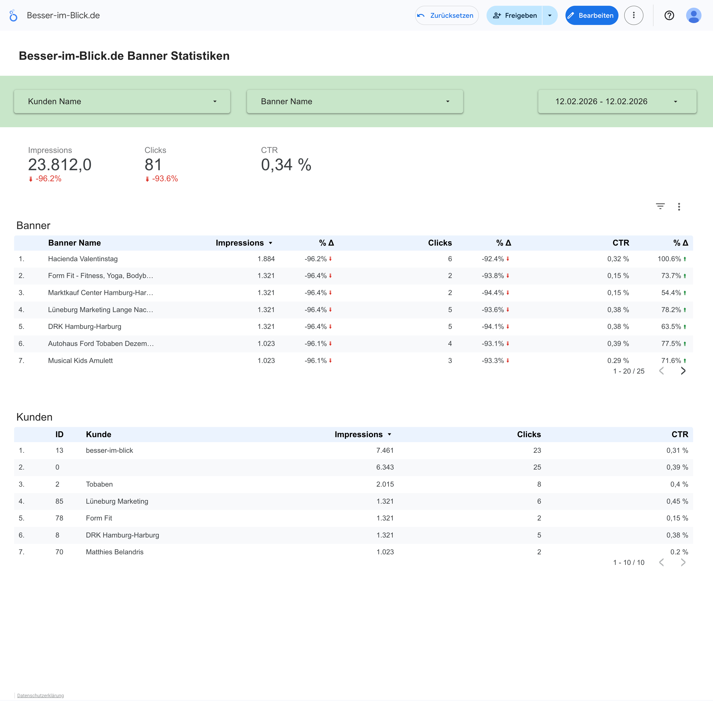

# API & Looker Studio

Die größte Stärke von KickBannerStats liegt in der **Entkopplung**: Während Joomla die Daten sammelt, können externe Tools wie **Google Looker Studio** diese visualisieren – ohne die Performance Ihrer Webseite zu belasten.

## Das Ergebnis

Mit der Integration können Sie interaktive Dashboards erstellen, die Sie direkt mit Ihren Werbekunden teilen können.



### Vorteile dieser Lösung
* 🚀 **Performance:** Der Report lädt blitzschnell, da er auf die aggregierte API zugreift und nicht Millionen von Datenbankzeilen durchsucht.
* 🔒 **Sicherheit:** Kunden erhalten Zugriff auf den Report, aber niemals direkten Zugriff auf Ihr Joomla-Backend.
* 🎨 **White-Label:** Gestalten Sie den Report in Ihrem Corporate Design (oder dem des Kunden).

---

## Die API Schnittstelle

KickBannerStats stellt einen nativen Joomla Webservice (API) Endpunkt bereit.

### Endpoint

```http
GET /api/index.php/v1/kickbannerstats/statistics

```

### Authentifizierung

Der Zugriff erfolgt über einen **Joomla API Token**. Erstellen Sie diesen im Backend unter **Benutzer** > **Verwalten** > (User auswählen) > **Joomla API Token**.

Der Token muss im Header der Anfrage gesendet werden:

```http
X-Joomla-Token: c2h...I6

```

### Filter Parameter

Sie können die Daten serverseitig filtern, um die Payload klein zu halten:

| Parameter | Typ | Beschreibung |
| --- | --- | --- |
| `filter[begin]` | `YYYY-MM-DD` | Startdatum (inklusiv) |
| `filter[end]` | `YYYY-MM-DD` | Enddatum (inklusiv) |
| `filter[client_id]` | `INT` | Nur Daten für einen spezifischen Kunden |
| `filter[banner_id]` | `INT` | Nur Daten für ein spezifisches Banner |

### Beispiel Response (JSON)

```json
[
    {
        "date": "2026-02-12",
        "banner_id": 422,
        "client_id": 13,
        "impressions": 1319,
        "clicks": 3,
        "banner_name": "KickBannerStats",
        "client_name": "kicktemp",
        "updated_at": "2026-02-13 03:00:00"
    },
    {
        "date": "2026-02-11",
        "banner_id": 422,
        "client_id": 13,
        "impressions": 41324,
        "clicks": 38,
        "banner_name": "KickBannerStats",
        "client_name": "kicktemp",
        "updated_at": "2026-02-13 03:00:00"
    }
]

```

---

## Google Looker Studio Connector

Um die JSON-Daten in Looker Studio zu nutzen, wird ein **Community Connector** (Google Apps Script) benötigt, der die Daten abruft und in das Looker-Format umwandelt.

### Schema Konfiguration

Im Connector werden die JSON-Felder wie folgt gemappt:

1. **Dimensionen (Grün):**
* `Date` (Typ: YYYYMMDD)
* `Banner Name` (Typ: Text)
* `Client Name` (Typ: Text)


2. **Metriken (Blau):**
* `Impressions` (Typ: Zahl)
* `Clicks` (Typ: Zahl)


3. **Berechnete Felder:**
* **CTR:** Erstellen Sie im Looker Studio ein Feld mit der Formel:
```sql
SUM(Clicks) / SUM(Impressions)

```


*(Formatieren Sie dieses Feld als Prozent)*


::: tip Caching Strategie
Da die Daten in Joomla nur einmal täglich (per Task) aktualisiert werden, sollten Sie im Looker Studio Connector das Caching aktivieren (z.B. für 12 Stunden). Dies beschleunigt den Report für den Endkunden extrem.
:::
