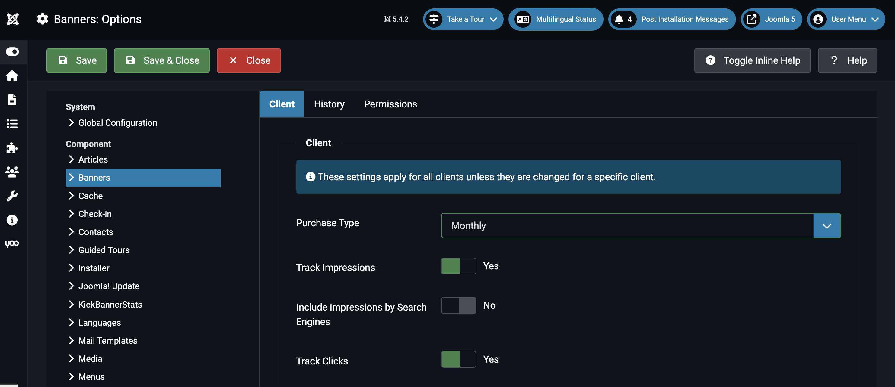
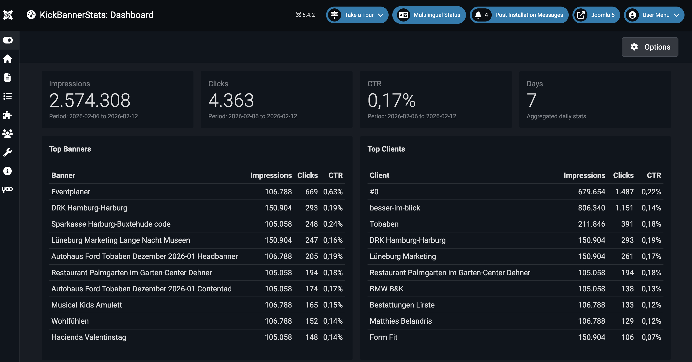
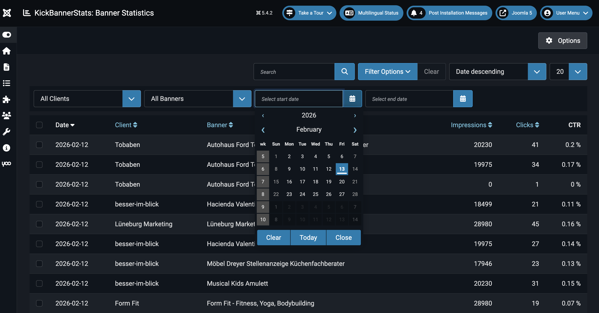

# Backend Nutzung

KickBannerStats integriert sich nahtlos in das Joomla-Backend. Bevor Sie jedoch Statistiken sehen können, muss sichergestellt werden, dass Joomla die Banner-Aktivitäten überhaupt aufzeichnet.

## 1. Voraussetzungen: Tracking aktivieren

KickBannerStats greift auf die Rohdaten der Joomla Core-Komponente `com_banners` zurück. Wenn das Tracking dort deaktiviert ist, bleiben die Statistiken leer.

Gehen Sie zu **System** > **Konfiguration** > **Banners** (oder über die Banner-Komponente auf "Optionen").

Stellen Sie im Reiter **Klient** (Client) folgende Werte sicher:

* **Impressionen erfassen (Track Impressions):** `Ja`
* **Klicks erfassen (Track Clicks):** `Ja`
* **Suchmaschinen-Impressionen erfassen:** `Nein` (Empfohlen, um verfälschte Statistiken durch Bots zu vermeiden)

::: warning Wichtig
Änderungen an diesen Einstellungen wirken sich nur auf **zukünftige** Daten aus. KickBannerStats kann keine Klicks aus der Vergangenheit anzeigen, wenn diese von Joomla nicht protokolliert wurden.
:::

---

## 2. Konfiguration

Sie können steuern, welcher Zeitraum standardmäßig im Dashboard angezeigt wird.

1.  Öffnen Sie **Komponenten** > **Banner-Statistiken**.
2.  Klicken Sie oben rechts auf den Button **Optionen**.
3.  Im Feld **Zeitraum (Tage)** definieren Sie die Standard-Ansicht (z.B. `30` für die letzten 30 Tage).

---

## 3. Das Dashboard

Das Dashboard bietet Ihnen einen schnellen Überblick über die Performance Ihrer Werbemittel. Die Daten hier sind **aggregiert**, das heißt, sie basieren auf den täglichen Zusammenfassungen des Task-Plugins.

### Die Kennzahlen (KPIs)
* **Impressionen:** Wie oft wurden Banner im gewählten Zeitraum geladen/angezeigt.
* **Klicks:** Wie oft wurde tatsächlich auf Banner geklickt.
* **CTR (Click-Through-Rate):** Das Verhältnis von Klicks zu Impressionen in Prozent.

$$\text{CTR} = \frac{\text{Klicks}}{\text{Impressionen}} \times 100$$

### Die Top-Listen
Darunter finden Sie zwei Tabellen, die Ihnen helfen, Ausreißer (positiv wie negativ) schnell zu erkennen:
* **Top Banner:** Welche Einzelbanner generieren die meisten Klicks?
* **Top Kunden:** Welcher Werbekunde performt am besten?

---

## 4. Statistik-Details

Für tiefere Analysen nutzen Sie den Menüpunkt **Statistik**. Hier sehen Sie die täglichen Werte pro Banner und Kunde.

### Filtermöglichkeiten
Nutzen Sie die **Suchwerkzeuge**, um die Datenmenge einzugrenzen:
* 📅 **Zeitraum:** Analysieren Sie Kampagnenzeiträume (Von / Bis).
* 🔍 **Suche:** Filtern Sie nach Namen von Bannern oder Kunden.
* 👤 **Kunde:** Zeigen Sie nur Daten eines spezifischen Werbepartners.

---

## 5. Automatisierung (Tasks)

Damit das Dashboard Daten anzeigt, muss der **Scheduled Task** (Geplante Aufgabe) laufen.

* **Task:** `KickBannerStats - Create Stats`
* **Intervall:** Sollte auf **Täglich** stehen (z.B. jede Nacht um 03:00 Uhr).

::: tip Funktionsweise
Der Task nimmt die Rohdaten aus `#__banner_tracks`, summiert sie pro Tag/Banner/Kunde und speichert sie in `#__kickbannerstats_daily`. Das Dashboard liest nur aus dieser optimierten Tabelle, um Ladezeiten von wenigen Millisekunden zu garantieren.
:::