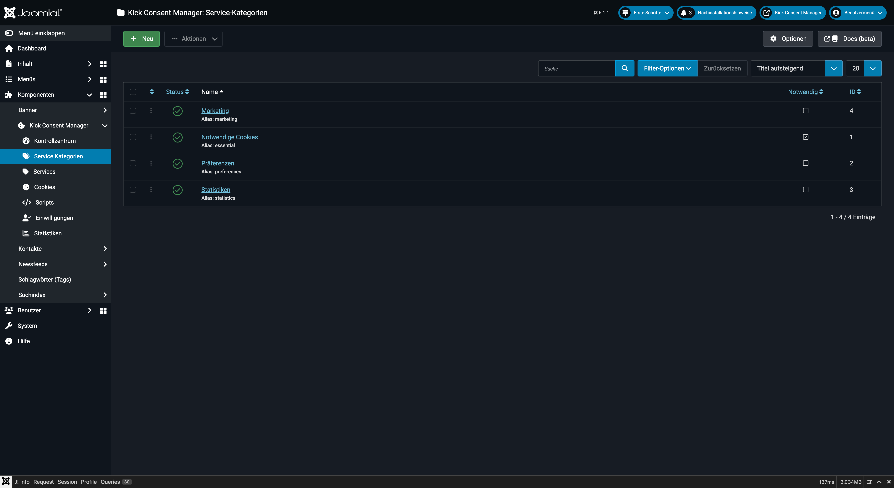
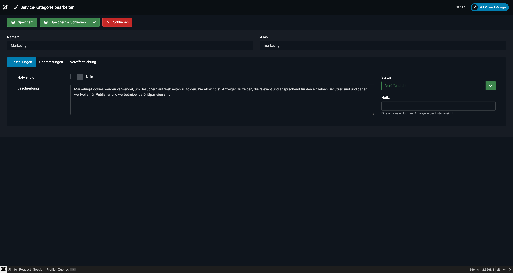

# Service-Kategorien

Service-Kategorien bilden die oberste Ebene im Datenmodell des KCM. Sie fassen mehrere **Services** thematisch zusammen und werden dem Nutzer im Cookie-Banner als Gruppen angezeigt.



## Konzept

Die Hierarchie lautet:

```
Service-Kategorie (z.B. "Marketing")
    └── Service (z.B. "Google Ads")
            ├── Cookie (z.B. "_gcl_au")
            └── Script (z.B. Google Tag Manager Code)
```

Im Frontend erscheint für jede Kategorie ein eigener Bereich mit einem Toggle-Switch, über den der Nutzer alle Services dieser Kategorie en bloc zustimmen oder ablehnen kann.

---

## Vorinstallierte Kategorien

Nach der Installation sind vier Standard-Kategorien angelegt:

| Kategorie | Alias | Notwendig | Beschreibung |
|---|---|---|---|
| Notwendige Cookies | `essential` | ✅ Ja | Grundfunktionen wie Navigation und sichere Bereiche |
| Präferenzen | `preferences` | Nein | Spracheinstellungen, Regionsauswahl |
| Statistiken | `statistics` | Nein | Anonyme Besucheranalyse |
| Marketing | `marketing` | Nein | Werbe-Cookies und Retargeting |

---

## Kategorie anlegen

1. Navigieren Sie zu **Komponenten → Kick Consent Manager → Service-Kategorien**.
2. Klicken Sie auf **Neu**.



### Felder

**Name** *(Pflichtfeld)*
Der interne und standardmäßige Anzeigename der Kategorie. Wird im Frontend angezeigt, wenn keine sprachspezifische Übersetzung vorhanden ist.

**Alias**
URL-freundlicher Bezeichner (wird automatisch aus dem Namen generiert). Muss innerhalb aller Kategorien eindeutig sein.

**Beschreibung**
Beschreibungstext der Kategorie (wird im Frontend angezeigt, z.B. unter dem Kategorienamen im Cookie-Preference-Center).

**Notwendig**
Wenn aktiviert, ist diese Kategorie immer aktiv und kann vom Nutzer nicht deaktiviert werden. Entspricht der rechtlichen Anforderung für technisch notwendige Cookies. Der Toggle-Switch ist dann ausgeblendet bzw. gesperrt.

::: warning Rechtlicher Hinweis
Setzen Sie „Notwendig" nur für Kategorien, die ausschließlich technisch zwingend erforderliche Cookies enthalten. Das Vorbelegen von Statistiken oder Marketing-Cookies als „notwendig" verstößt gegen die DSGVO.
:::

**Übersetzungen**
Für mehrsprachige Websites können Name und Beschreibung pro Sprache gepflegt werden. Das Subformular erlaubt beliebig viele Sprachvarianten.

| Feld | Beschreibung |
|---|---|
| Sprache | Joomla-Sprachcode (z.B. `de-DE`, `en-GB`) oder `*` für alle |
| Name | Übersetzter Kategoriename |
| Beschreibung | Übersetzte Beschreibung |

---

## Sortierung

Die Reihenfolge der Kategorien im Frontend entspricht der Sortierung in der Liste. Diese kann per Drag & Drop in der Backend-Listenansicht angepasst werden.

---

## Status

Kategorien können veröffentlicht, unveröffentlicht, archiviert oder in den Papierkorb verschoben werden. Unveröffentlichte Kategorien (und ihre Services) erscheinen nicht im Frontend-Banner.
