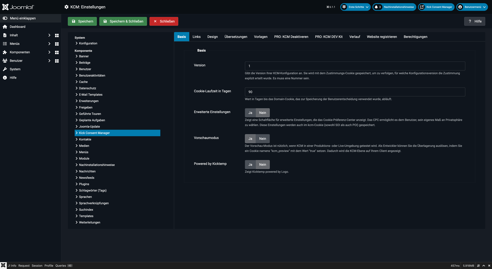
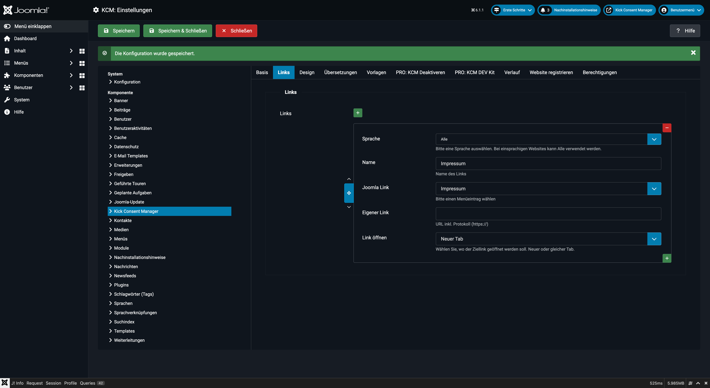
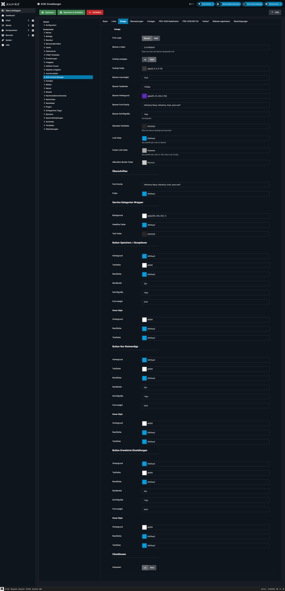
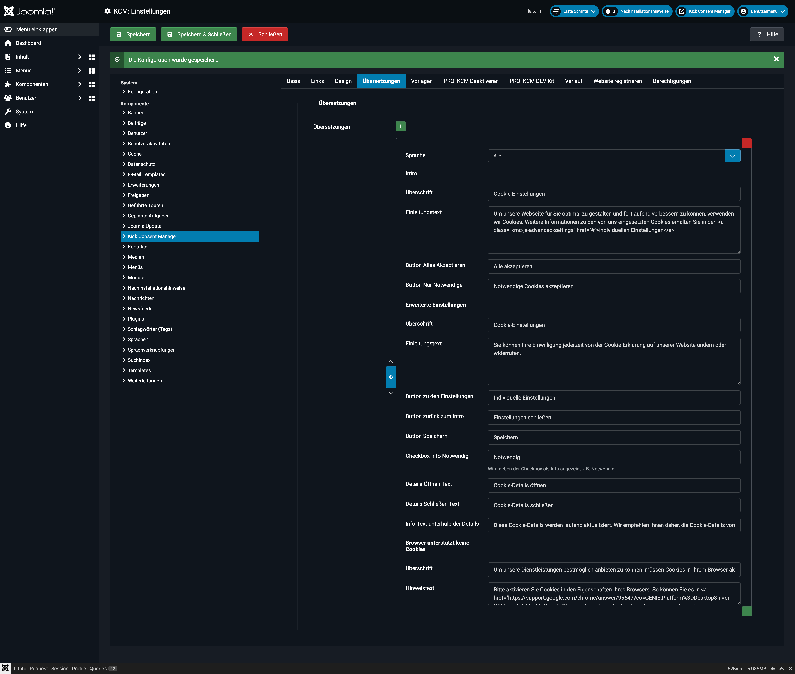
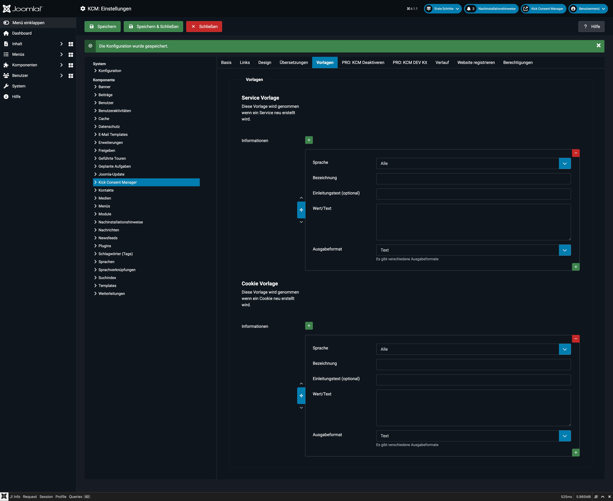
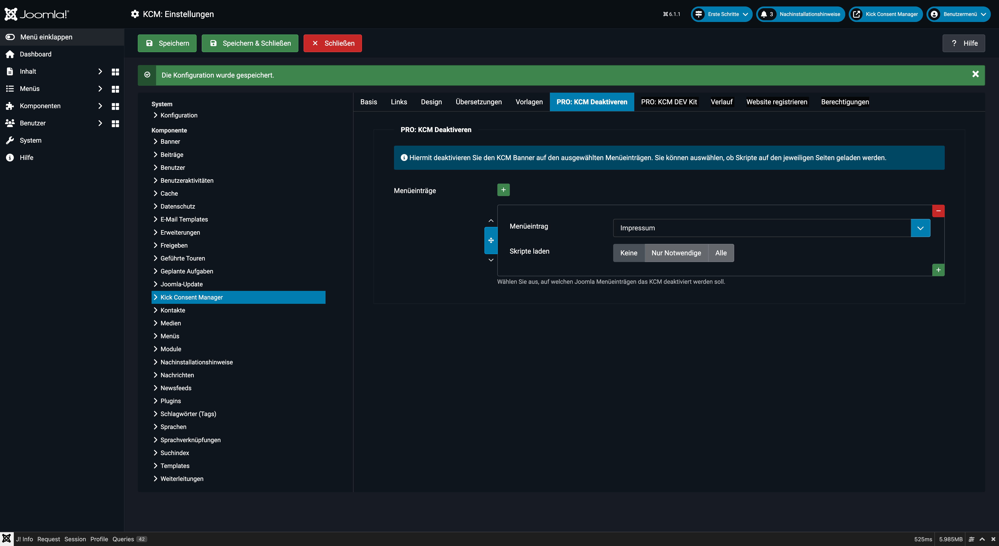
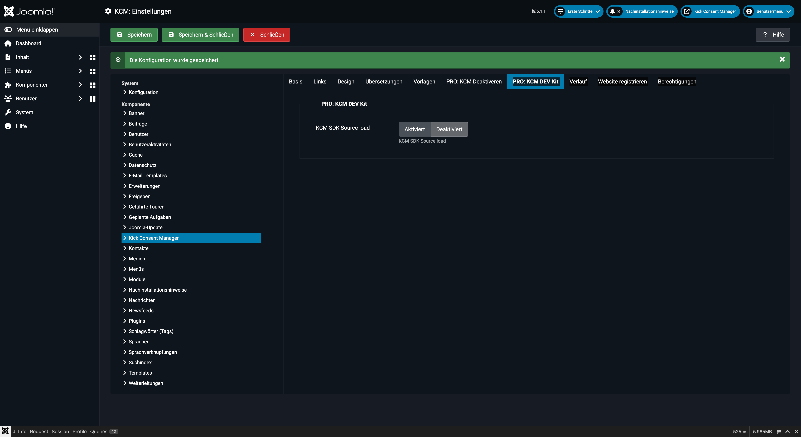
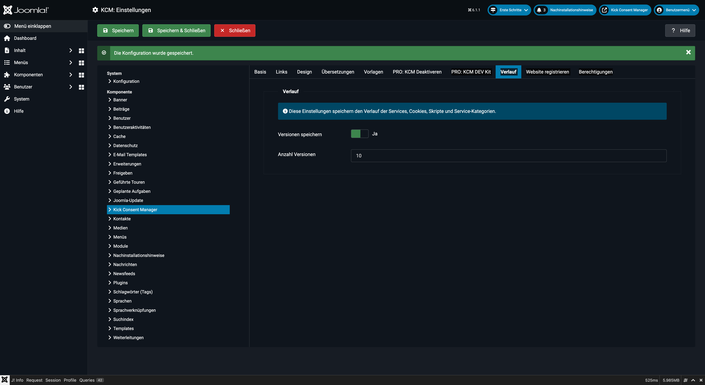
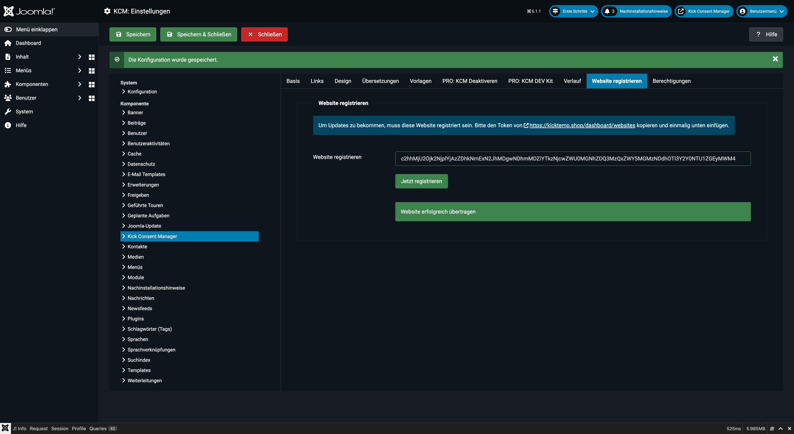

# Konfiguration

Die Konfiguration des KCM erfolgt über den **Optionen**-Button im Backend (oben rechts in der Toolbar). Die Einstellungen sind in neun Tabs gegliedert.

---

## Tab 1: Basis

### Konfigurationsversion

- Typ: Zahl
- Standard: `1`

Versionsnummer der aktuellen KCM-Konfiguration. Diese Nummer wird im Consent-Cookie gespeichert. Wenn Sie die Konfiguration inhaltlich ändern (z.B. neue Services, geänderte Cookie-Beschreibungen), erhöhen Sie diese Zahl um 1. Bestehende Besucher werden dann erneut um ihre Einwilligung gebeten, weil die gespeicherte Version nicht mehr mit der aktuellen übereinstimmt.

::: warning
Erhöhen Sie die Konfigurationsversion nur, wenn eine neue Einwilligung rechtlich erforderlich ist (z.B. neue Tracking-Tools). Unnötige Versionserhöhungen nerven Besucher.
:::

### Cookie-Laufzeit (Tage)

- Typ: Zahl
- Standard: `90`

Gibt an, wie viele Tage der `kcm_data`-Cookie im Browser des Nutzers gespeichert bleibt. Nach Ablauf muss der Nutzer erneut einwilligen.

### Erweiterte Einstellungen

- Standard: `Ja`

Zeigt im Banner den Button „Individuelle Einstellungen", der das Cookie-Preference-Center (CPC) öffnet. Dort kann der Nutzer einzelne Services aktivieren oder deaktivieren.

Wenn deaktiviert, sieht der Nutzer nur die Buttons „Alle akzeptieren" und „Notwendige Cookies akzeptieren" – ohne die Möglichkeit, einzelne Kategorien anzupassen.

### Vorschau-Modus

- Standard: `Nein`

Im Vorschau-Modus wird das Banner für alle Besucher angezeigt, auch wenn bereits eine Einwilligung gespeichert ist. Nützlich für Tests im Live-Betrieb. **Nicht für die Produktion aktivieren.**

### Powered by

- Standard: `Ja`

Blendet einen dezenten „Powered by Kick Consent Manager"-Link am unteren Rand des Banners ein.

---

## Tab 2: Links

Konfiguriert die Datenschutz- und Impressumslinks, die im Banner erscheinen.

Das Subformular erlaubt pro Sprache einen eigenen Link:

| Feld | Beschreibung |
|---|---|
| Sprache | Joomla-Sprachcode oder `*` für alle Sprachen |
| Bezeichnung | Anklickbarer Link-Text (z.B. „Datenschutz") |
| Joomla-Menüpunkt | Verknüpfung mit einem Joomla-Menüeintrag |
| Eigene URL | Alternativ: direkte URL eingeben |
| Ziel | `_blank` (neuer Tab) oder `_self` (gleicher Tab) |

::: tip Mehrsprachige Websites
Legen Sie für jede aktive Sprache einen eigenen Link-Eintrag an. Der KCM wählt automatisch den passenden Link basierend auf der aktuellen Seitensprache.
:::

---

## Tab 3: Design

Alle visuellen Aspekte des Banners sind hier konfigurierbar, ohne CSS-Kenntnisse.

### Layout

| Option | Beschreibung |
|---|---|
| Banner | Traditionelles Banner am unteren/oberen Bildschirmrand |
| Wall | Vollflächige Überlagerung (Cookie-Wall) |

### Z-Index

- Standard: `2147483647` (höchstmöglicher Wert)

Steuert, ob das Banner über allen anderen Elementen liegt. Nur anpassen, wenn Konflikte mit anderen Overlays auftreten.

### Overlay

Wenn aktiviert, wird der Seitenhintergrund beim Anzeigen des Banners abgedunkelt.

- **Overlay-Hintergrundfarbe**: RGBA-Farbe für das Overlay (Standard: `rgba(0, 0, 0, 0.75)`)

### Banner-Größe

| Feld | Standard | Beschreibung |
|---|---|---|
| Max. Höhe | `70vh` | Maximale Höhe des Banners |
| Max. Inhalt-Breite | `1200px` | Maximale Inhaltsbreite |

### Farben & Schriften

| Feld | Standard | Beschreibung |
|---|---|---|
| Hintergrundfarbe | `rgba(255,255,255,0.95)` | Banner-Hintergrund |
| Schriftart | `Helvetica Neue, Arial, sans-serif` | Hauptschrift |
| Schriftgröße | `16px` | Basis-Schriftgröße |
| Textfarbe | `#262626` | Fließtext |
| Linkfarbe | `#009ee3` | Links im Bannertext |
| Untere Linkfarbe | `#aaaaaa` | Datenschutz-/Impressums-Links |
| Service-Rahmenfarbe | `#ccc` | Rahmen um Service-Einträge im CPC |

### Überschrift

| Feld | Standard |
|---|---|
| Überschrift-Schriftart | `Helvetica Neue, Arial, sans-serif` |
| Überschrift-Farbe | `#009ee3` |

### Kategorien

| Feld | Standard |
|---|---|
| Kategorien-Hintergrundfarbe | `rgba(255,255,255,1)` |
| Kategorien-Überschrift-Farbe | `#009ee3` |
| Kategorien-Textfarbe | `#262626` |

### Buttons (Speichern / Alle akzeptieren)

| Feld | Standard |
|---|---|
| Hintergrundfarbe | `#009ee3` |
| Textfarbe | `#ffffff` |
| Rahmenfarbe | `#009ee3` |
| Rahmenbreite | `2px` |
| Schriftgröße | `18px` |
| Schriftstärke | `bold` |

**Hover-Zustand:**

| Feld | Standard |
|---|---|
| Hintergrundfarbe (Hover) | `#ffffff` |
| Rahmenfarbe (Hover) | `#009ee3` |
| Textfarbe (Hover) | `#009ee3` |

### Button „Notwendige akzeptieren"

Identische Felder wie der primäre Button, aber mit eigenen Standardwerten (kleinere Schriftgröße: `14px`).

### Toggle-Switch

Steuert die Ein/Aus-Schalter für einzelne Kategorien/Services im CPC.

**Switch Override aktivieren**: Wenn deaktiviert, wird der Standard-Joomla/Browser-Stil verwendet. Wenn aktiviert, stehen folgende Farboptionen zur Verfügung:

| Zustand | Felder |
|---|---|
| Aus (Off) | Hintergrundfarbe, Marker-Farbe |
| Ein (On) | Hintergrundfarbe, Marker-Farbe |
| Intermediär | Hintergrundfarbe, Marker-Farbe |
| Deaktiviert | Hintergrundfarbe, Marker-Farbe |

---

## Tab 4: Übersetzungen

Alle Texte des Banners und des Cookie-Preference-Centers können hier pro Sprache angepasst werden.

Das Subformular erlaubt für jede Joomla-Sprache eigene Texte:

### Banner-Texte (Startansicht)

| Feld | Standard (Deutsch) |
|---|---|
| Überschrift | „Cookie-Einstellungen" |
| Einleitungstext | Beschreibungstext mit Link zu individuellen Einstellungen |
| Button „Alle akzeptieren" | „Alle akzeptieren" |
| Button „Notwendige Cookies akzeptieren" | „Notwendige Cookies akzeptieren" |

### Cookie-Preference-Center (CPC) Texte

| Feld | Standard (Deutsch) |
|---|---|
| CPC-Überschrift | „Cookie-Einstellungen" |
| CPC-Beschreibungstext | Hinweis auf Widerrufsmöglichkeit |
| Button „Individuelle Einstellungen" | „Individuelle Einstellungen" |
| Button „Einstellungen schließen" | „Einstellungen schließen" |
| Button „Speichern" | „Speichern" |
| Label „Notwendig" | „Notwendig" |
| Link „Cookie-Details öffnen" | „Cookie-Details öffnen" |
| Link „Cookie-Details schließen" | „Cookie-Details schließen" |
| Aktualisierungshinweis | Hinweis auf regelmäßige Cookie-Aktualisierungen |

### Kein-Cookie-Meldung

Wird angezeigt, wenn Cookies im Browser deaktiviert sind:

| Feld | Standard |
|---|---|
| Überschrift | Hinweis auf deaktivierte Cookies |
| Text | Anleitung zum Aktivieren in Chrome/Firefox |

::: tip Einleitungstext mit Link
Der Standard-Einleitungstext enthält `<a class='kmc-js-advanced-settings' href='#'>individuelle Einstellungen</a>`. Dieser Link öffnet automatisch das Cookie-Preference-Center. Behalten Sie diese CSS-Klasse im Einleitungstext, wenn Sie möchten, dass Nutzer dort direkt zum CPC gelangen.
:::

---

## Tab 5: Vorlagen

Hier können globale Informationsfeld-Vorlagen für **Services** und **Cookies** definiert werden. Diese dienen als Vorlage-Struktur beim Anlegen neuer Einträge und vereinheitlichen die Datenpflege.

**Service-Vorlagen**: Vordefinierte Informationsfelder für neue Services (z.B. immer die Felder „Zweck", „Anbieter", „Datenschutz-URL").

**Cookie-Vorlagen**: Entsprechend für neue Cookie-Einträge (z.B. immer die Felder „Ablauf", „Typ", „Zweck").

---

## Tab 6: KCM deaktivieren (Menüpunkte)

Für bestimmte Joomla-Menüpunkte (z.B. Datenschutzerklärung, Impressum) kann der KCM deaktiviert oder in einem anderen Modus betrieben werden.

Das Subformular erlaubt pro Menüpunkt eine Einstellung:

| Feld | Beschreibung |
|---|---|
| Menüpunkt | Joomla-Menüeintrag auswählen |
| Script-Modus | Steuert, welche Scripts auf dieser Seite geladen werden |

**Script-Modi:**

| Modus | Beschreibung |
|---|---|
| Keine Scripts | Auf dieser Seite werden gar keine KCM-Scripts geladen (auch nicht für zugestimmte Services). Geeignet für Seiten, auf denen kein Tracking stattfinden soll. |
| Notwendige Scripts | Nur Scripts von als „notwendig" markierten Service-Kategorien werden geladen. |
| Alle Scripts | Alle Scripts werden geladen, unabhängig von der Nutzerpräferenz. Achtung: Nur für Seiten geeignet, auf denen eine Einwilligung nicht erforderlich ist. |

::: warning
Der Modus „Alle Scripts" lädt Scripts ohne Einwilligung des Nutzers. Verwenden Sie diesen Modus nur, wenn Sie rechtlich sicher sind, dass dies für den jeweiligen Menüpunkt zulässig ist.
:::

---

## Tab 7: KCM DevKit

Das DevKit ist ein Entwickler-Tool, das im Frontend eingeblendet wird und den aktuellen Consent-Status in Echtzeit anzeigt.

### DevKit aktivieren

- Standard: `Deaktiviert`

Wenn aktiviert, erscheint im Frontend ein kleines Panel, das zeigt:
- Alle konfigurierten Services und ihren Zustimmungsstatus
- Den Inhalt des `kcm_data`-Cookies
- Debugging-Informationen zur aktuellen Konfiguration

::: warning Nur für Entwicklung
Das DevKit sollte in der Produktion **deaktiviert** bleiben. Es ist ausschließlich für Entwicklung und Testing gedacht.
:::

---

## Tab 8: Versionen (History)

Steuert die Joomla-eigene Versionierung von KCM-Einträgen.

| Feld | Standard | Beschreibung |
|---|---|---|
| Versionen speichern | Nein | Aktiviert das Joomla Content History Feature |
| Maximale Versionen | `10` | Wie viele Versionen pro Eintrag aufbewahrt werden |

Wenn aktiviert, wird zu jedem Service, Cookie, Script und jeder Kategorie eine Versionsgeschichte geführt. Über das History-Icon in der Bearbeitungsansicht können ältere Versionen eingesehen und wiederhergestellt werden.

---

## Tab 9: Bei Kicktemp registrieren

Optionale Registrierung Ihrer Website-Domain im Kicktemp-Shop für Lizenz- und Update-Zwecke.

---

## Tab: Berechtigungen

Standard-Joomla-ACL (Access Control List) für die Komponente. Steuert, welche Joomla-Benutzergruppen auf welche Bereiche des KCM zugreifen dürfen (Verwalten, Erstellen, Bearbeiten, Löschen etc.).
