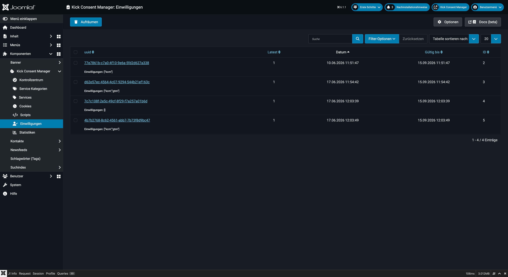
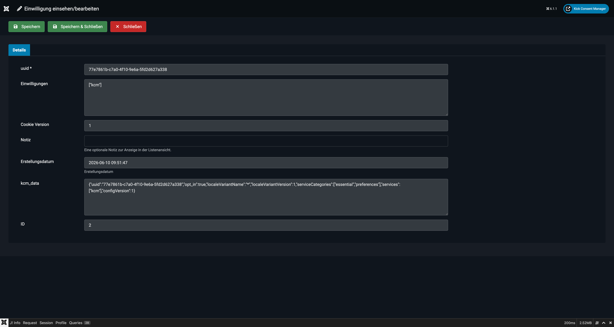

# Einwilligungen (Consent-Protokoll)

Der Bereich **Einwilligungen** protokolliert alle Consent-Entscheidungen der Website-Besucher. Jeder Eintrag ist einem Besucher (via UUID), einem Zeitstempel und den gewählten Services zugeordnet.



## Was wird gespeichert?

Sobald ein Besucher im Cookie-Banner eine Entscheidung trifft (Zustimmen, Ablehnen oder individuelle Auswahl), legt der KCM einen Eintrag in der Datenbanktabelle `#__kickconsentmanager_consents` an.

Gespeichert werden:

| Feld | Inhalt |
|---|---|
| **UUID** | Eindeutige Besucher-ID (im Browser-Cookie `kcm_data` gespeichert) |
| **Cookie-Version** | Version der Konfiguration zum Zeitpunkt der Einwilligung |
| **Einwilligungen** | JSON-Liste der akzeptierten Services |
| **kcm_data** | Rohdaten des gespeicherten Browser-Cookies |
| **Erstellt am** | Zeitstempel der Einwilligung |
| **Gültig bis** | Ablaufdatum (Standard: 90 Tage nach Erstellung) |
| **Latest** | Markiert den jeweils aktuellsten Eintrag einer UUID |

---

## Einwilligung einsehen

Klicken Sie auf einen Eintrag in der Liste, um die gespeicherten Details zu sehen.



### UUID
Die UUID identifiziert einen Browser (nicht einen Nutzer). Mehrere Einwilligungseinträge mit derselben UUID gehören zum selben Browser, zum Beispiel wenn ein Nutzer seine Einwilligung zu einem späteren Zeitpunkt geändert hat.

### Cookie-Version
Die Versionsnummer der KCM-Konfiguration (definiert in den Einstellungen unter „Basis"). Wenn Sie die Konfigurationsversion erhöhen (z.B. nach einer inhaltlichen Änderung der Datenschutzerklärung), müssen bestehende Nutzer erneut zustimmen.

### Einwilligungen
JSON-Darstellung der akzeptierten Services. Beispiel:
```json
{
  "kcm": true,
  "google-analytics": true,
  "youtube": false
}
```

### Latest
Gibt an, ob dieser Eintrag der aktuellste für diese UUID ist. Ältere Einträge (nach einer erneuten Zustimmung) haben `Latest = 0`.

---

## Suche und Filterung

In der Listenansicht stehen folgende Filtermöglichkeiten zur Verfügung:

- **Suche**: Durchsucht UUID, Einwilligungs-JSON und kcm_data. Mit dem Präfix `UUID:` gezielt nach einer bestimmten UUID suchen.
- **Letzter Eintrag**: Filtert nach `is_latest = 1` (aktuellste Einwilligungen) oder `= 0` (ältere Versionen).
- **Zeitraum**: Filterung nach dem Erstellungsdatum.

---

## Aufräumen (Purge)

Es gibt zwei Wege, abgelaufene Einwilligungseinträge zu entfernen:

### Manuell per Button

Über den Button **Aufräumen** in der Toolbar werden alle Einträge gelöscht, deren `expired`-Datum in der Vergangenheit liegt.

### Automatisch per Task-Plugin (empfohlen)

Das mitgelieferte **Task-Plugin** (`plg_task_kickconsentmanager`) erledigt das Aufräumen automatisch nach einem konfigurierbaren Zeitplan. So muss niemand manuell eingreifen.

**Einrichtung:**
1. Unter **System → Plugins** (Typ: `task`) das Plugin **Aufgabe – Kick Consent Manager Einwilligungen bereinigen** aktivieren.
2. Unter **System → Geplante Aufgaben → Neu** eine neue Aufgabe anlegen.
3. Im Aufgabentyp-Picker die Kachel **Einwilligungen bereinigen** auswählen.
4. Ausführungsregel: `Intervall, Minuten` — für wöchentliches Ausführen `10080` eintragen.
5. Parameter **Tage** setzen: Einwilligungen, die älter als dieser Wert sind und deren Ablaufdatum überschritten ist, werden gelöscht. Maximalwert entspricht der Cookie-Laufzeit aus den Einstellungen.

::: tip Aufbewahrungspflicht
Prüfen Sie mit Ihrem Datenschutzbeauftragten, wie lange Einwilligungsnachweise aufbewahrt werden müssen. In manchen Fällen kann eine längere Aufbewahrung als 90 Tage rechtlich sinnvoll sein – passen Sie in diesem Fall den Tage-Parameter und das Task-Intervall entsprechend an.
:::

---

## Datenbank-Tabelle

```sql
CREATE TABLE `#__kickconsentmanager_consents` (
  `id`             INT UNSIGNED NOT NULL AUTO_INCREMENT,
  `uuid`           VARCHAR(40) NOT NULL DEFAULT '',
  `cookie_version` INT UNSIGNED DEFAULT NULL,
  `consents`       TEXT DEFAULT NULL,        -- JSON der akzeptierten Services
  `is_latest`      TINYINT NOT NULL DEFAULT 0,
  `created`        DATETIME NOT NULL,
  `expired`        DATETIME NOT NULL,        -- Ablaufdatum des Consents
  `note`           VARCHAR(255) NOT NULL DEFAULT '',
  `rawdata`        TEXT DEFAULT NULL,        -- Roher Cookie-Inhalt
  PRIMARY KEY (`id`),
  KEY `idx_uid` (`uuid`)
)
```

---

## Datenschutz-Hinweis

Die Consent-Protokollierung speichert bewusst **keine personenbezogenen Daten** wie IP-Adressen oder Nutzerkonten. Die UUID ist an den Browser-Cookie gebunden und nicht auf eine natürliche Person zurückführbar.

::: info
Informieren Sie Besucher in Ihrer Datenschutzerklärung über die Speicherung des `kcm_data`-Cookies und der zugehörigen Einwilligungsdaten gemäß Art. 13 DSGVO.
:::
