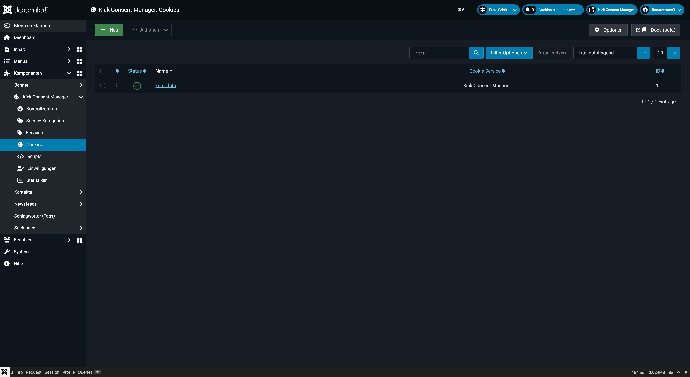
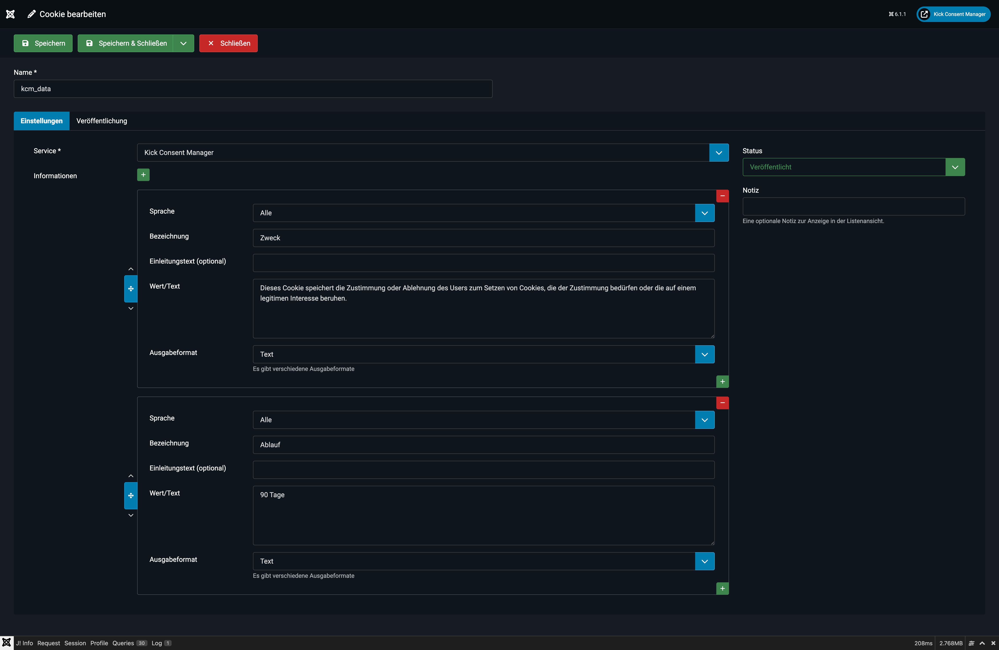

# Cookies

Ein **Cookie-Eintrag** dokumentiert einen konkreten Browser-Cookie, den ein Service setzt. Diese Einträge werden im Cookie-Preference-Center (erweitertes Banner) angezeigt und helfen dabei, die gesetzlichen Informationspflichten zu erfüllen.



## Konzept

Cookies sind der untersten Ebene des Datenmodells zugeordnet:

```
Service-Kategorie
    └── Service
            └── Cookie  ← hier
```

Jeder Cookie-Eintrag gehört genau einem Service. Im Frontend erscheinen die Cookies eines Services aufklappbar unter dem jeweiligen Service-Eintrag.

---

## Cookie anlegen

1. Navigieren Sie zu **Komponenten → Kick Consent Manager → Cookies**.
2. Klicken Sie auf **Neu**.



### Felder

**Name** *(Pflichtfeld)*
Der technische Name des Cookies, so wie er im Browser gesetzt wird (z.B. `_ga`, `_gid`, `_fbp`, `kcm_data`). Name + Service müssen in Kombination eindeutig sein.

**Service** *(Pflichtfeld)*
Zuordnung zu einem vorhandenen Service.

**Informationen**
Strukturierte Informationsfelder zur Beschreibung des Cookies. Empfohlene Felder:

| Bezeichnung | Beispielwert |
|---|---|
| Zweck | Unterscheidung von Nutzersitzungen |
| Ablauf | 2 Jahre |
| Typ | HTTP-Cookie |
| Anbieter | Google LLC |
| Datenschutz | https://policies.google.com/privacy |

Die gleichen Ausgabeformate wie bei Services stehen zur Verfügung (Text, Link, Liste, E-Mail).

**Notiz** *(intern)*
Interne Anmerkung, nur im Backend sichtbar.

---

## Vorinstallierter Cookie

Nach der Installation ist ein Cookie-Eintrag angelegt:

**kcm_data**
- Service: Kick Consent Manager
- Zweck: Speichert die Einwilligung oder Ablehnung des Nutzers zur Cookie-Nutzung
- Ablauf: 90 Tage (konfigurierbar in den Einstellungen)

---

## Cookie-Informationsvorlagen

In den Einstellungen (Tab „Vorlagen") kann eine globale Vorlage für Cookie-Informationsfelder definiert werden. Diese dient als Vorlage beim Anlegen neuer Cookie-Einträge und spart Zeit bei gleichartigen Feldern.

---

## Häufig gesetzte Cookies dokumentieren

Hier ein Überblick typischer Cookies bekannter Dienste als Orientierung:

### Google Analytics (GA4)

| Cookie | Zweck | Ablauf |
|---|---|---|
| `_ga` | Unterscheidung von Nutzern | 2 Jahre |
| `_ga_XXXXXXXX` | Sitzungsstatus | 2 Jahre |

### Facebook / Meta Pixel

| Cookie | Zweck | Ablauf |
|---|---|---|
| `_fbp` | Browser-Identifikation für Ads | 3 Monate |
| `fr` | Werbe-Cookie | 3 Monate |

### YouTube (eingebettete Videos)

| Cookie | Zweck | Ablauf |
|---|---|---|
| `YSC` | Video-Session | Session |
| `VISITOR_INFO1_LIVE` | Schätzung der Bandbreite | 6 Monate |

::: warning Rechtliche Vollständigkeit
Diese Liste ist nicht abschließend. Prüfen Sie regelmäßig (z.B. mit Browser-Entwicklertools oder einem Cookie-Scanner), welche Cookies Ihre Website tatsächlich setzt, und dokumentieren Sie alle im KCM.
:::

---

## Status

Cookies können wie andere Einträge veröffentlicht, unveröffentlicht oder archiviert werden. Unveröffentlichte Cookies erscheinen nicht im Cookie-Preference-Center.
