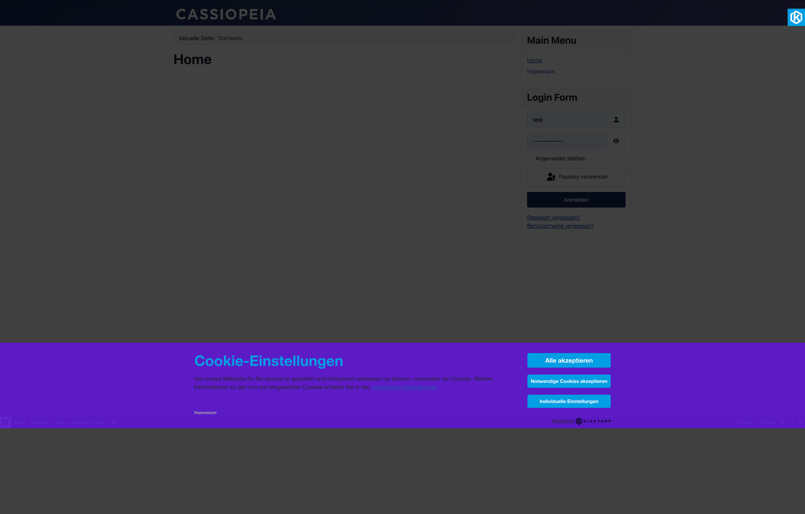
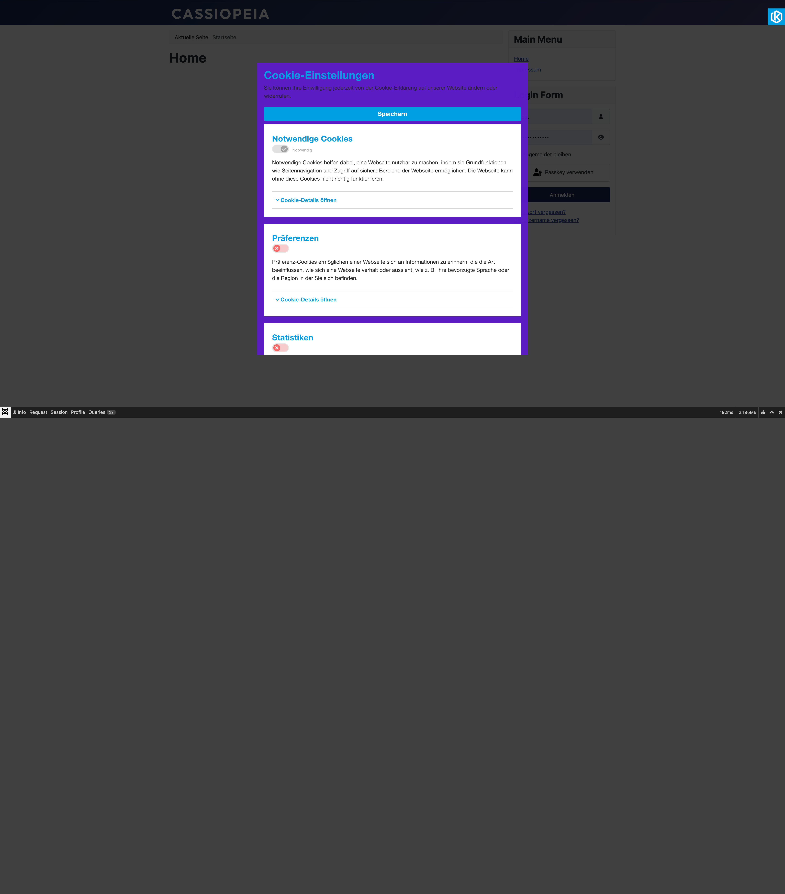
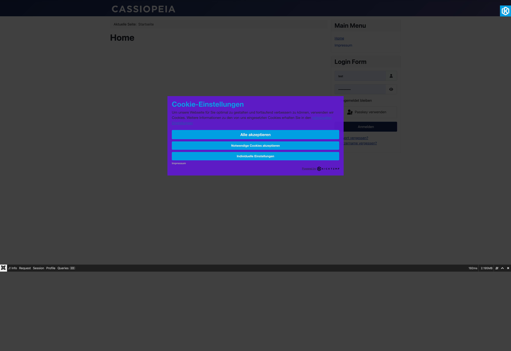
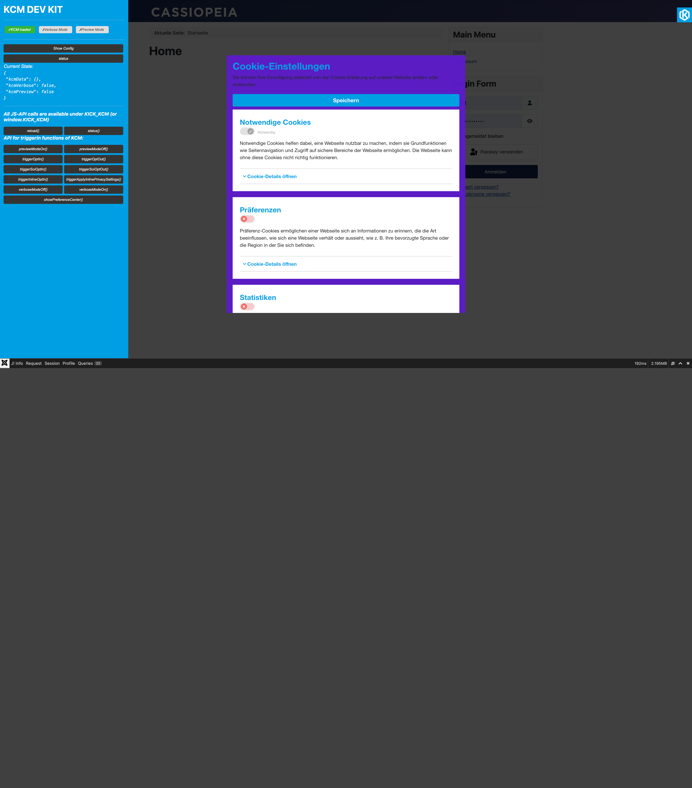

# Frontend

Der KCM zeigt beim ersten Besuch einer Website ein **Cookie-Banner** an. Abhängig von der Konfiguration gibt es zwei Layouts: das klassische **Banner** und die **Cookie-Wall**.

---

## Banner (Standard-Layout)

Das Banner erscheint als Overlay und zeigt dem Besucher zunächst eine kompakte Ansicht mit:

- Einem Einleitungstext (konfigurierbar)
- Dem Link zu den Datenschutzinformationen
- Dem Button **„Alle akzeptieren"**
- Dem Button **„Notwendige Cookies akzeptieren"**
- Optional: Dem Button **„Individuelle Einstellungen"**



---

## Cookie-Preference-Center (Erweiterte Ansicht)

Klickt der Nutzer auf „Individuelle Einstellungen", öffnet sich das **Cookie-Preference-Center (CPC)**. Hier kann der Nutzer pro Kategorie oder pro Service entscheiden:



Das CPC zeigt:
- Alle veröffentlichten **Service-Kategorien** mit ihrem Notwendig-Status
- Innerhalb jeder Kategorie alle zugehörigen **Services** mit Beschreibung und Informationsfeldern
- Aufklappbare **Cookie-Details** pro Service
- Toggle-Switches für jede Kategorie/jeden Service
- Den Button **„Speichern"** zum Übernehmen der Auswahl
- Den Button **„Einstellungen schließen"** zum Zurückkehren ohne Änderung

---

## Cookie-Wall (Wall-Layout)

Beim Wall-Layout überdeckt das Banner den gesamten Seiteninhalt. Der Besucher kommt erst an den Inhalt, nachdem er eine Entscheidung getroffen hat.



Das Wall-Layout aktivieren Sie in den Einstellungen unter **Tab Design → Layout → Wall**.

::: warning Rechtliche Anforderungen
Eine Cookie-Wall, die den Zugang zur Website vollständig sperrt, ist in bestimmten EU-Ländern und nach Auslegung der DSGVO rechtlich umstritten. Holen Sie rechtlichen Rat ein, bevor Sie das Wall-Layout einsetzen.
:::

---

## Ablauf einer Einwilligung

```
1. Besucher öffnet Seite erstmals
        ↓
2. KCM prüft: Existiert ein gültiger kcm_data-Cookie?
   Nein → Banner anzeigen
   Ja  → Scripts der eingewilligten Services laden
        ↓
3. Besucher trifft Entscheidung (Alle / Notwendige / Individuell)
        ↓
4. KCM speichert Einwilligung:
   - im Browser-Cookie kcm_data (Laufzeit: konfigurierbar)
   - in der Datenbank (Consent-Protokoll mit UUID)
        ↓
5. Zugestimmte Scripts werden sofort geladen
        ↓
6. Bei erneutem Besuch: kcm_data-Cookie vorhanden → kein Banner
```

---

## Einwilligung widerrufen

Der Besucher kann seine Einwilligung jederzeit ändern. Hierfür gibt es mehrere Möglichkeiten:

**Über einen erneuten Aufruf des Banners:**
Auf Ihrer Datenschutzseite (oder per Klick auf einen von Ihnen platzierten Link) kann der Besucher das Banner erneut öffnen. Empfohlener Ansatz: Ein Link oder Button mit der CSS-Klasse `kcm-js-open` oder eine JavaScript-Funktion.

**Über den Browser:**
Durch Löschen aller Cookies im Browser wird der `kcm_data`-Cookie entfernt, und das Banner erscheint beim nächsten Besuch erneut.

---

## KCM DevKit (Entwickler)

Das DevKit ist ein im Frontend einblendbares Debug-Panel, das in den Einstellungen aktiviert werden kann.



Es zeigt:
- Status aller konfigurierten Services (zugestimmt / abgelehnt)
- Inhalt des `kcm_data`-Cookies
- Konfigurationsversion
- Debug-Informationen

::: warning Nur für Entwicklung
Das DevKit immer in der Produktion deaktivieren.
:::

---

## Verhalten bei deaktivierten Cookies

Wenn der Browser des Nutzers Cookies vollständig deaktiviert hat, kann der KCM keine Einwilligung speichern. In diesem Fall zeigt der KCM die **Kein-Cookie-Meldung** an (Text konfigurierbar in Tab „Übersetzungen").

---

## Frontend-Menüpunkt

Der KCM registriert optional einen Frontend-Menüpunkt, der eine Übersicht aller Services mit deren Cookie-Details anzeigt. Dieser Menüpunkt kann als eigenständige „Cookie-Erklärungsseite" verwendet werden und ist über **Menüs → Menüpunkt hinzufügen → Kick Consent Manager** erreichbar.
