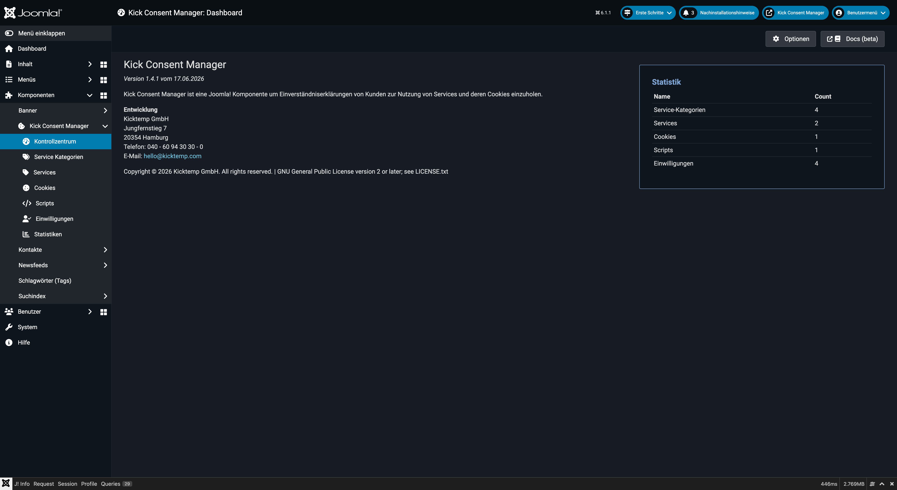

# Kick Consent Manager

Der **Kick Consent Manager (KCM)** ist eine vollständige Consent-Management-Komponente für **Joomla 5 & 6**. Er ermöglicht es Website-Betreibern, die Einwilligung ihrer Besucher zur Nutzung von Cookies und externen Services datenschutzkonform einzuholen, zu speichern und nachzuweisen – entsprechend den Anforderungen der DSGVO und der ePrivacy-Richtlinie.

::: tip Joomla 5 & 6 ready
Der Kick Consent Manager wurde speziell für **Joomla 5 und Joomla 6** entwickelt und ist vollständig kompatibel mit der modernen Joomla-Architektur (Namespaces, MVC, ACL).
:::



## Was ist der Kick Consent Manager?

Der KCM zeigt Besuchern beim ersten Seitenaufruf ein **Cookie-Banner** (oder eine vollflächige „Cookie-Wall") an. Erst wenn der Besucher aktiv zustimmt, werden die entsprechenden Tracking-Skripte und Marketing-Tools geladen. Jede Einwilligung wird mit UUID, Zeitstempel und den gewählten Services protokolliert und ist im Backend auswertbar.

## Hauptfunktionen

### 🍪 Strukturiertes Cookie-Datenmodell
Cookies werden nicht einfach aufgelistet, sondern einem **Service** zugeordnet, der wiederum einer **Service-Kategorie** angehört (z.B. „Google Analytics" → Kategorie „Statistiken"). Diese Hierarchie ermöglicht eine saubere, übersichtliche Darstellung im Frontend.

### 📜 Scripts-Verwaltung
Externe Skripte (Tracking-Codes, Pixel, Tag Manager etc.) werden direkt im Backend verwaltet und **erst nach Zustimmung** des Nutzers geladen. Skripte können wahlweise in `<head>` oder `</body>` eingebunden werden, als Inline-Code oder als externe URL.

### ✅ Consent-Protokollierung
Jede Einwilligung wird mit einer **UUID** persistent gespeichert. Der Nachweis der Einwilligung ist damit jederzeit abrufbar – wichtig für rechtliche Anforderungen.

### 📊 Statistiken
Das Backend zeigt Opt-in- und Opt-out-Raten über konfigurierbare Zeiträume an, aufgeschlüsselt nach Services.

### 🎨 Vollständig anpassbares Design
Farben, Schriften, Abstände, Overlay – alle visuellen Aspekte des Banners lassen sich über die Einstellungen ohne CSS-Kenntnisse anpassen.

### 🌍 Mehrsprachig
Alle Texte des Banners (Überschrift, Beschreibungstext, Button-Beschriftungen) können pro Joomla-Sprache individuell gepflegt werden.

### 🔒 Cookie-Wall
Optional kann das Banner als vollständige **Cookie-Wall** konfiguriert werden, die den Seiteninhalt blockiert, bis der Besucher eine Entscheidung trifft.

### 🛠️ KCM DevKit
Ein einblendbares Entwickler-Panel, das den aktuellen Consent-Status, alle gesetzten Services und den Cookie-Inhalt in Echtzeit anzeigt.

---

## Systemvoraussetzungen

| Anforderung | Version |
|---|---|
| Joomla! | **5.x oder 6.x** |
| PHP | 8.1 oder höher |
| MySQL / MariaDB | 8.0 / 10.4 |

---

## Kernkonzepte

Der KCM arbeitet mit vier zentralen Entitäten, die aufeinander aufbauen:

```
Service-Kategorien
    └── Services
            ├── Cookies
            └── Scripts
```

- **Service-Kategorien** gruppieren Services logisch (z.B. Notwendige Cookies, Statistiken, Marketing).
- **Services** repräsentieren einzelne Tools oder Anbieter (z.B. Google Analytics, YouTube).
- **Cookies** sind die technischen Cookie-Einträge, die ein Service setzt.
- **Scripts** sind die Tracking-Codes und externen Skripte, die bei Zustimmung geladen werden.

---

## Nächste Schritte

- **[Installation & Erste Schritte](./getting-started):** Komponente installieren und sofort loslegen.
- **[Konfiguration](./configuration):** Alle Einstellungen im Überblick.
- **[Service-Kategorien](./categories):** Kategorien anlegen und verwalten.
- **[Services](./services):** Anbieter und Dienste erfassen.
- **[Cookies](./cookies):** Cookie-Einträge pflegen.
- **[Scripts](./scripts):** Tracking-Skripte verwalten.
- **[Einwilligungen](./consents):** Consent-Protokoll einsehen.
- **[Statistiken](./statistics):** Opt-in/Opt-out-Auswertungen.
- **[Frontend](./frontend):** Banner und Cookie-Wall in der Praxis.
- **[Architektur](./architecture):** Technische Übersicht für Entwickler.
