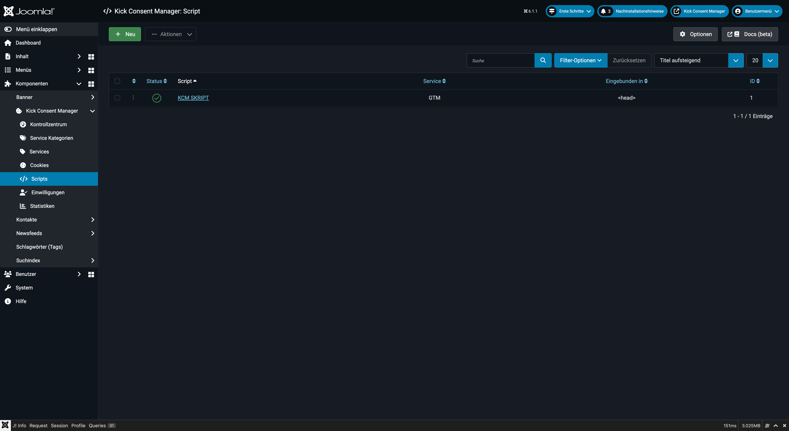
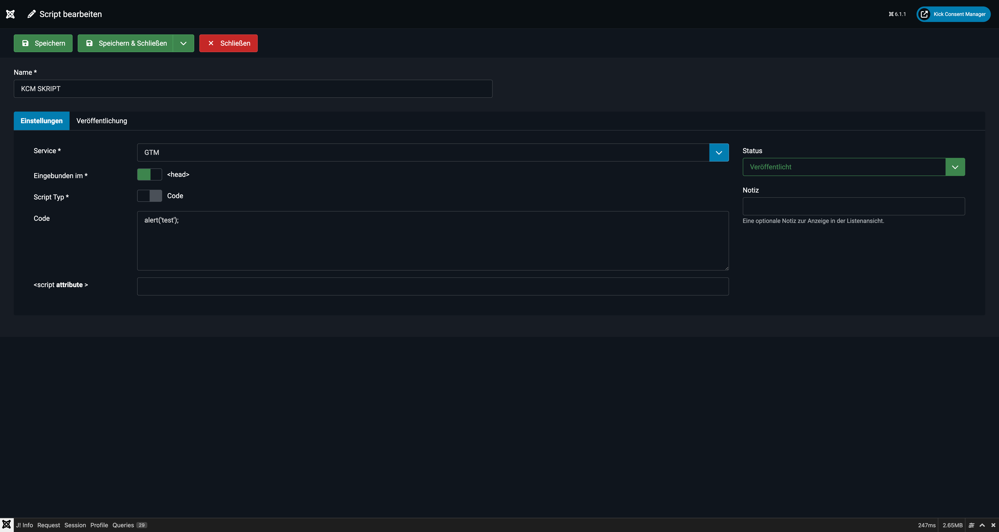

# Scripts

**Scripts** sind das eigentliche „Herzstück" des KCM in technischer Hinsicht: Sie enthalten die Tracking-Codes und externen Skript-URLs, die der KCM nur dann in die Seite einbindet, wenn der Nutzer dem zugehörigen Service zugestimmt hat.



## Konzept

Ohne den KCM würden Tracking-Skripte (z.B. Google Analytics, Facebook Pixel) bei jedem Seitenaufruf automatisch geladen. Mit dem KCM werden sie **blockiert**, bis der Nutzer zustimmt:

```
Nutzer stimmt "Statistiken" zu
    → KCM gibt alle Scripts frei, die dem Service "Google Analytics" zugeordnet sind
        → Script wird in <head> oder </body> eingefügt
```

---

## Script anlegen

1. Navigieren Sie zu **Komponenten → Kick Consent Manager → Scripts**.
2. Klicken Sie auf **Neu**.



### Felder

**Script Bezeichnung** *(Pflichtfeld)*
Ein beschreibender Name für das Script, nur intern sichtbar (z.B. „Google Analytics GA4 Code").

**Eingebunden im**
Bestimmt, wo das Script in den HTML-Quelltext eingefügt wird:

| Wert | Position | Empfehlung |
|---|---|---|
| `<head>` | Im `<head>`-Bereich | Standard für die meisten Tracking-Tags |
| `</body>` | Vor dem schließenden `</body>` | Für Scripts, die Seiteninhalte beeinflussen |

**Script Typ**
Wählen Sie zwischen:

- **Code** — Inline-JavaScript-Code (wird als `<script>…</script>` eingefügt)
- **Src** — Externe Script-URL (wird als `<script src="…">` eingebunden)

**Code** *(bei Typ „Code")*
Das eigentliche JavaScript. Fügen Sie hier den Tracking-Code ohne umschließende `<script>`-Tags ein.

```javascript
// Beispiel: Google Analytics GA4
window.dataLayer = window.dataLayer || [];
function gtag(){dataLayer.push(arguments);}
gtag('js', new Date());
gtag('config', 'G-XXXXXXXXXX');
```

**Src** *(bei Typ „Src")*
Die URL des externen Scripts.

```
https://www.googletagmanager.com/gtag/js?id=G-XXXXXXXXXX
```

**Executed** *(bei Typ „Src")*
Ladeattribut für externe Scripts:

| Wert | Bedeutung |
|---|---|
| Standard | Synchrones Laden (blockiert das Rendering) |
| `defer` | Script wird nach dem HTML-Parsing ausgeführt |
| `async` | Script wird asynchron geladen und ausgeführt |

Für Tracking-Scripts empfiehlt sich in der Regel `async` oder `defer`.

**`<script attribute>`**
Zusätzliche HTML-Attribute für den `<script>`-Tag (z.B. `data-domain="example.com"` für Plausible Analytics, oder `nonce="…"` für Content Security Policies).

**Service** *(Pflichtfeld)*
Weist das Script einem Service zu. Das Script wird nur geladen, wenn der Nutzer diesem Service zugestimmt hat.

**Sprache**
Optional: Bindet das Script nur für eine bestimmte Sprachversion der Website ein. Nützlich, wenn z.B. ein Tracking-Pixel nur für die deutsche Sprachversion relevant ist.

**Veröffentlichungszeitraum**
Optionale Start- und Enddaten: Das Script wird nur innerhalb des definierten Zeitraums geladen. Praktisch für zeitlich begrenzte Kampagnen.

---

## Praxisbeispiel: Google Analytics GA4

Für Google Analytics GA4 benötigen Sie typischerweise **zwei Scripts**:

**Script 1 – GA4 Library (Src)**
- Typ: `Src`
- Src: `https://www.googletagmanager.com/gtag/js?id=G-XXXXXXXXXX`
- Executed: `async`
- Eingebunden im: `<head>`
- Service: Google Analytics

**Script 2 – GA4 Config (Code)**
- Typ: `Code`
- Code:
```javascript
window.dataLayer = window.dataLayer || [];
function gtag(){dataLayer.push(arguments);}
gtag('js', new Date());
gtag('config', 'G-XXXXXXXXXX');
```
- Eingebunden im: `<head>`
- Service: Google Analytics

---

## Praxisbeispiel: Facebook Pixel

**Script – Facebook Pixel (Code)**
- Typ: `Code`
- Eingebunden im: `<head>`
- Service: Facebook / Meta
- Code:
```javascript
!function(f,b,e,v,n,t,s)
{if(f.fbq)return;n=f.fbq=function(){n.callMethod?
n.callMethod.apply(n,arguments):n.queue.push(arguments)};
// ... (vollständiger Pixel-Code von Facebook)
fbq('init', 'XXXXXXXXXXXXXXXXX');
fbq('track', 'PageView');
```

---

## Wichtig: Kein manuelles Einbinden im Template

::: warning
Tracking-Codes dürfen **nicht** manuell im Joomla-Template (z.B. in `index.php`) eingebunden sein, wenn sie consent-gesteuert über den KCM laufen sollen. Manuell eingebundene Scripts werden unabhängig von der Nutzereinwilligung geladen.
:::

---

## Status und Zeitsteuerung

Scripts unterstützen:
- **Veröffentlicht / Unveröffentlicht**: Deaktivieren Sie Scripts schnell ohne sie zu löschen.
- **Sprach-Filterung**: Nur für eine bestimmte Joomla-Sprache laden.
- **Zeitplanung**: `Veröffentlichung starten` und `Veröffentlichung beenden` für kampagnenbezogene Scripts.
- **Zugriffsebene**: Einschränken, für welche Joomla-Zugriffsebenen das Script geladen wird.
