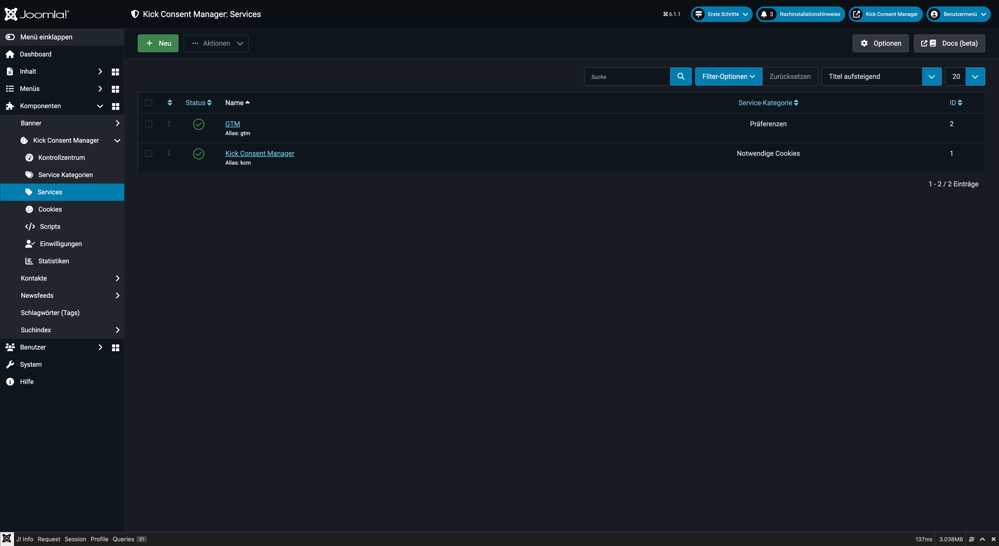
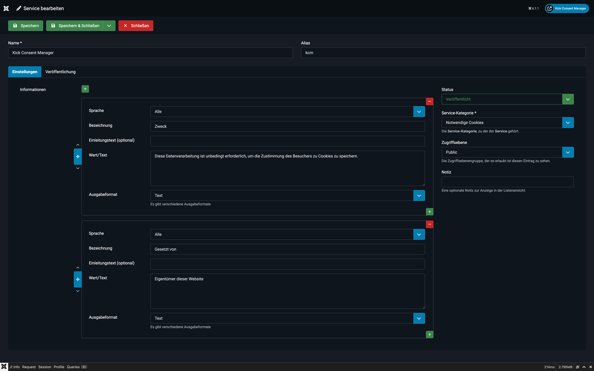

# Services

Ein **Service** repräsentiert einen konkreten Drittanbieter oder eine Funktion Ihrer Website, für die Cookies gesetzt oder Skripte geladen werden. Beispiele: Google Analytics, YouTube, Facebook Pixel, Hotjar.

## Konzept

Services sind der zentrale Baustein des KCM-Datenmodells. Sie verknüpfen:
- eine **Service-Kategorie** (z.B. „Statistiken")
- zugehörige **Cookies** (z.B. `_ga`, `_gid`)
- zugehörige **Scripts** (z.B. den Google Analytics Tracking-Code)

Im Frontend-Banner werden Services als einzelne Einträge innerhalb ihrer Kategorie angezeigt. Der Nutzer sieht Name, Beschreibung und die zugehörigen Cookie-Details.

---

## Service anlegen

1. Navigieren Sie zu **Komponenten → Kick Consent Manager → Services**.
2. Klicken Sie auf **Neu**.

### Felder

**Name** *(Pflichtfeld)*
Der Anzeigename des Services im Frontend (z.B. „Google Analytics", „YouTube").

**Alias**
Eindeutiger URL-Bezeichner. Muss systemweit eindeutig sein – ein doppelter Alias (auch im Papierkorb) wird abgelehnt.

**Service-Kategorie** *(Pflichtfeld)*
Weist den Service einer Kategorie zu. Diese Zuordnung bestimmt, in welcher Kategorie der Service im Banner erscheint.

**Informationen**
Dieses Subformular erlaubt die Pflege strukturierter Informationsfelder, die im Cookie-Preference-Center neben dem Service angezeigt werden. Typische Felder:

| Bezeichnung | Beispielwert | Ausgabeformat |
|---|---|---|
| Gesetzt von | Eigentümer dieser Website | Text |
| Zweck | Besucheranalyse | Text |
| Datenschutz | https://policies.google.com | Link |
| Speicherdauer | 2 Jahre | Text |
| Empfänger | Google LLC | Text |
| Drittlandübertragung | USA | Text |

**Ausgabeformate für Informationsfelder:**

- `Text` — einfacher Text
- `Textbereich` — mehrzeiliger Text
- `Liste` — kommagetrennte Werte als Liste
- `Link` — klickbarer Hyperlink
- `E-Mail` — mailto-Link

**Notiz** *(intern)*
Interne Anmerkung, die nur im Backend sichtbar ist (z.B. „Implementiert von Max M. am 2025-01-15").

---

## Informationsvorlagen (Presets)

In den Einstellungen (Tab „Vorlagen") können globale Vorlagen für Service-Informationsfelder angelegt werden. Diese beschleunigen die Pflege, wenn mehrere Services ähnliche Felder benötigen (z.B. immer das gleiche Datenschutz-URL-Format).

---

## Vordefinierter Service

Nach der Installation ist ein Service angelegt:

**Kick Consent Manager**
- Kategorie: Notwendige Cookies
- Zweck: Einwilligung des Besuchers speichern
- Gesetzt von: Eigentümer dieser Website

Dieser Service dokumentiert den eigenen Cookie (`kcm_data`) des Consent Managers und sollte nicht gelöscht werden.

---

## Status und Lebenszyklus

| Status | Bedeutung |
|---|---|
| Veröffentlicht | Im Frontend sichtbar |
| Unveröffentlicht | Ausgeblendet, zugehörige Scripts werden nicht geladen |
| Archiviert | Nicht aktiv, aber historisch erhalten |
| Papierkorb | Zur Löschung vorgemerkt |

::: tip Deaktivierung
Wenn ein Service temporär nicht benötigt wird (z.B. ein Tool wird nicht mehr verwendet), setzen Sie ihn auf „Unveröffentlicht". Alle zugehörigen Scripts werden dann nicht mehr geladen, ohne die Daten zu verlieren.
:::
