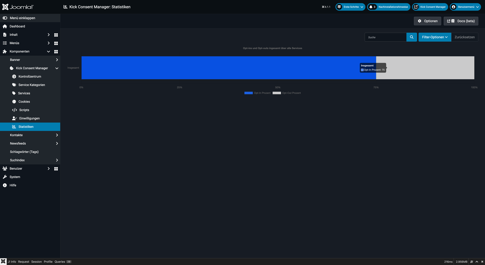

# Statistiken

Der Bereich **Statistiken** gibt einen Überblick über das Einwilligungsverhalten der Besucher: Wie viele stimmen zu? Wie viele lehnen ab? Welche Services werden am häufigsten akzeptiert?



## Überblick

Die Statistik-Ansicht aggregiert die Daten aus der Einwilligungstabelle und zeigt:

- **Gesamtanzahl** der gespeicherten Einwilligungsentscheidungen im gewählten Zeitraum
- **Opt-in-Prozent**: Anteil der Nutzer, die einem Service zugestimmt haben
- **Opt-out-Prozent**: Anteil der Nutzer, die einen Service abgelehnt haben
- Aufschlüsselung **pro Service** über alle ausgewerteten Einwilligungen

---

## Zeitraum filtern

Über die Filterwerkzeuge können Sie den Auswertungszeitraum eingrenzen:

| Filter | Beschreibung |
|---|---|
| Heute | Nur Einwilligungen vom aktuellen Tag |
| Gestern | Nur der gestrige Tag |
| In der letzten Woche | Die letzten 7 Tage |
| Im letzten Monat | Die letzten 30 Tage |
| In den letzten 3 Monaten | 90-Tage-Fenster |
| In den letzten 6 Monaten | 180-Tage-Fenster |
| Im letzten Jahr | 365-Tage-Fenster |
| Mehr als 1 Jahr her | Ältere Einträge |
| Niemals | Keine Zeiteinschränkung (alle Daten) |
| Eigener Zeitraum | Anfangsdatum und Enddatum manuell eingeben |

---

## Kennzahlen verstehen

### Opt-in-Rate

Der Prozentsatz der Nutzer, die einem bestimmten Service zugestimmt haben, bezogen auf alle Einwilligungsentscheidungen im Zeitraum.

$$\text{Opt-in} = \frac{\text{Einwilligungen mit Zustimmung für Service X}}{\text{Alle Einwilligungsentscheidungen}} \times 100$$

### Opt-out-Rate

Entsprechend der Prozentsatz der Ablehnungen.

### Interpretation

- Eine niedrige Opt-in-Rate für Marketing-Services ist normal und rechtlich gewollt (informierte Einwilligung).
- Stark steigende Opt-out-Raten können auf eine schlechte Banner-Usability oder mangelndes Vertrauen hindeuten.
- Sehr niedrige Zahlen insgesamt können auf technische Probleme mit dem Banner hindeuten (z.B. Banner wird nicht angezeigt).

---

## Datengrundlage

Die Statistiken basieren auf der Tabelle `#__kickconsentmanager_consents`. Jeder Eintrag enthält im Feld `consents` ein JSON-Objekt mit allen Service-Aliases und dem jeweiligen Boolean (true/false).

Beispiel:
```json
{
  "kcm": true,
  "google-analytics": true,
  "youtube": false,
  "facebook-pixel": false
}
```

Der KCM iteriert über alle Einträge im gewählten Zeitraum und zählt pro Service die Zustimmungen und Ablehnungen.

---

## Hinweise

::: tip Nur aktuellste Einwilligungen
Für aussagekräftige Statistiken empfiehlt es sich, nur Einwilligungen mit `is_latest = 1` zu zählen. So wird jeder Besucher nur einmal gezählt, selbst wenn er seine Einwilligung mehrfach geändert hat.
:::

::: warning Datenlücken nach Konfigurationsänderungen
Wenn Sie die Cookie-Version in den Einstellungen erhöhen, beginnen Nutzer erneut zu entscheiden. Auswertungen über längere Zeiträume können Einwilligungen verschiedener Konfigurationsversionen mischen. Beachten Sie dies bei der Interpretation der Daten.
:::
