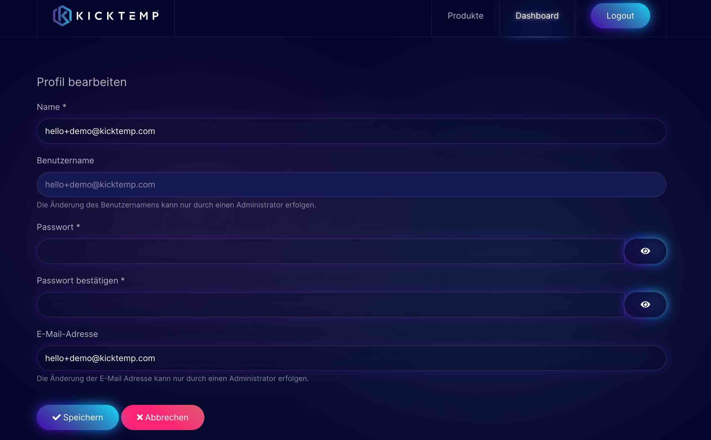

# Kauf

## Wie kaufe ich das Plugin?

Um das Plugin „Kick YOOaddons“ zu kaufen, gehe auf unsere Webseite: https://kicktemp.shop/.
Hier erhältst du eine Übersicht, was in den jeweiligen Subscriptions enthalten ist, was diese kosten und kannst dich ganz einfach für dein passendes Angebot entscheiden.

Mit einem Klick auf den Button „Jetzt kaufen“ beginnt der Kaufprozess.

## Kaufprozess

In einem Pop-up-Fenster wird eine Bestellübersicht angezeigt. Gib deine Rechnungsadresse an und klicke auf „Fortfahren“, um deine Zahlungsmethode zu wählen. Gib die Daten deines Zahlungsmittels an und führe die Zahlung durch.
Nach erfolgreichem Kaufabschluss erhältst du eine E-Mail mit deinen Zugangsdaten (Benutzername und Passwort).

**Achtung!** Bitte beachte, dass die E-Mail möglicherweise in den Spamordner sortiert wird.

## Passwort ändern

**Achtung!** Bitte beachte, dass das Passwort nur einmal gültig ist und nach dem ersten erfolgreichen Login geändert werden muss.

Ändere das Passwort unter „Dashboard - Profil“.

Solltest du Probleme mit deinem Login haben, dann kannst du uns jederzeit unter support@kicktemp.com schreiben. Wir helfen dir gern weiter.
