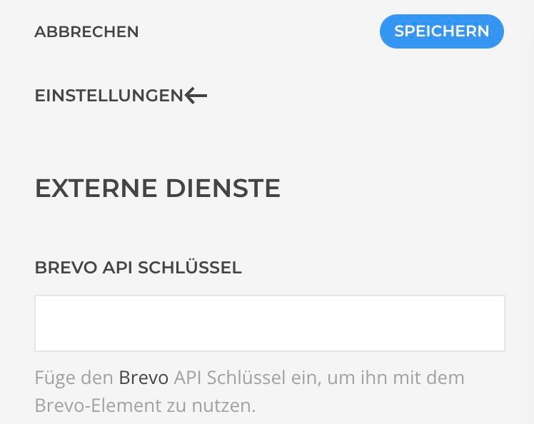
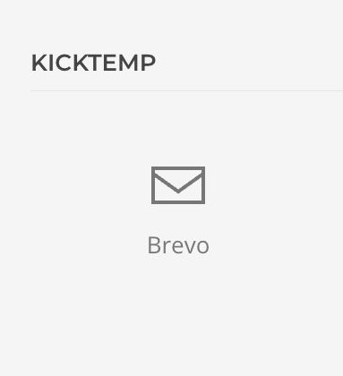
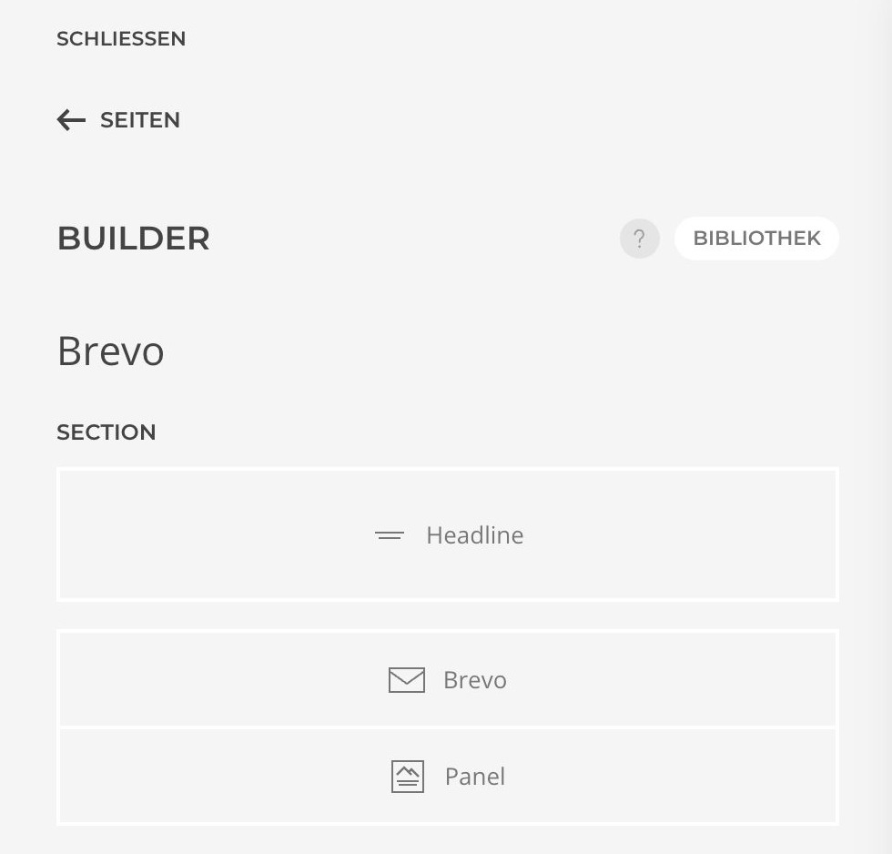

# Integration

1. Um auf Daten oder Templates aus Brevo zugreifen zu können, muss der API-Schlüssel hinterlegt werden. Gehe dafür in die Einstellungen von YOOtheme und wähle die externen Dienste aus. Über den dort angegebenen Link gelangst du direkt auf die Seite von Brevo, zur Generierung eines API-Token. Kopiere deinen API-Token und hinterlege diesen in den Einstellungen von YOOtheme.

> [!IMPORTANT]
>Du musst bei Brevo registriert und angemeldet sein um die Seite aufrufen zu können.

2. Erstelle mit dem Builder innerhalb einer Section das Brevo-Element. Dieses findest du unter den Kicktemp Elements.

|                                                                       |                                                                   |
|-----------------------------------------------------------------------|-------------------------------------------------------------------|
|  |  |

3. Wähle nun das Brevo-Element aus, um deine gewünschten Einstellungen vorzunehmen.

Jetzt kannst du auf Daten und Templates aus Brevo zugreifen und diese direkt in YOOtheme nutzen.
