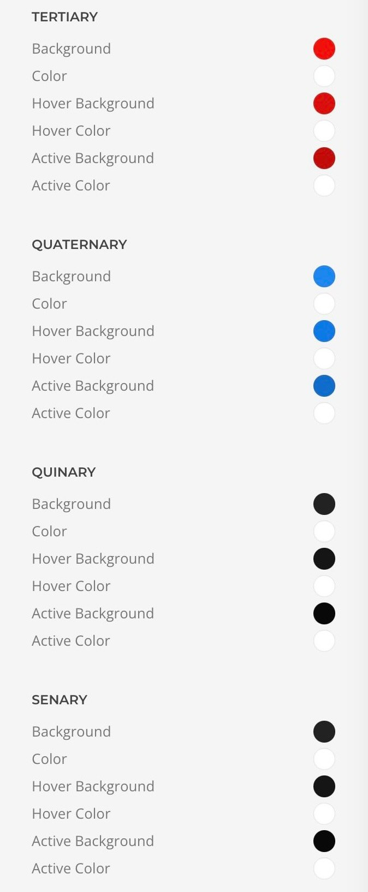

# Overview - Farben

## Einführung

Das Addon Farben erweitert die standard Styleoptionen um 4 weitere Farben. Nach der Installation stehen dir folgende Styleoptionen zusätzlich zur Verfügung **Tertiary**, **Quaternary**, **Quinary** und **Senar**.

So hast du mehr Möglichkeiten und Flexibilität bei der Gestaltung deiner Webseite.
Diese Optionen können für folgende Elemente genutzt werden:

**Elemente**

- button item
- column
- description list
- gallery
- grid
- headline
- map
- panel
- panel-slider
- popover
- overlay
- overlay-slider
- section
- slideshow
- switcher
- table
- text

## Video
