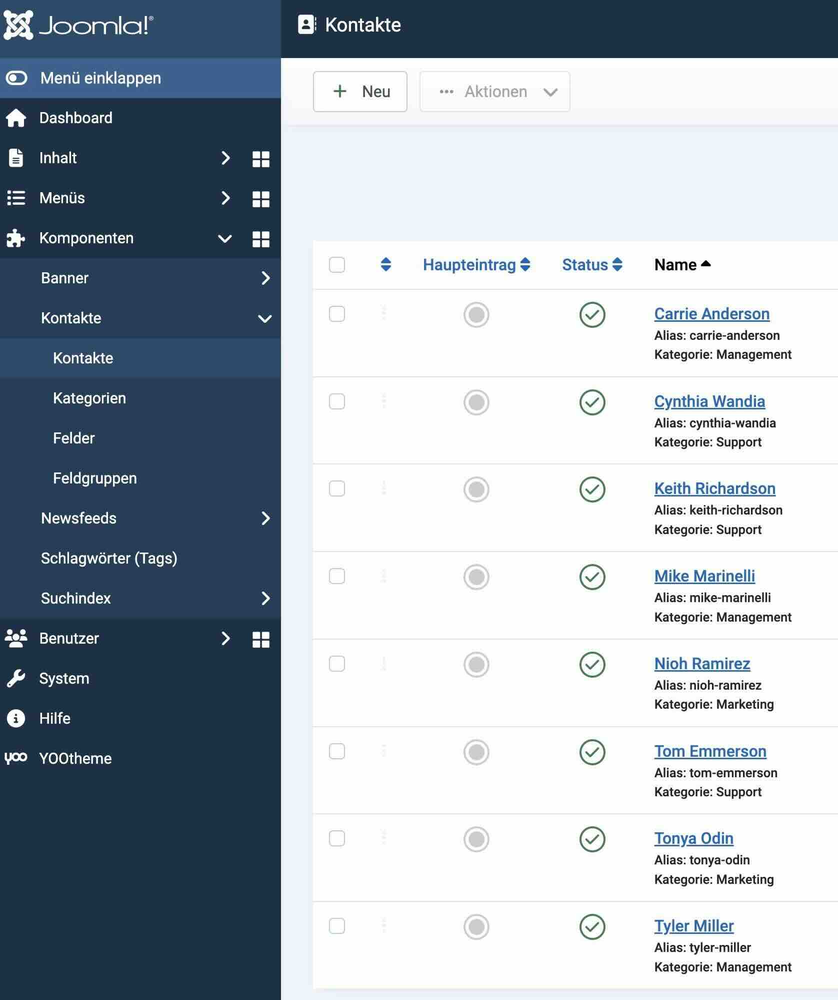
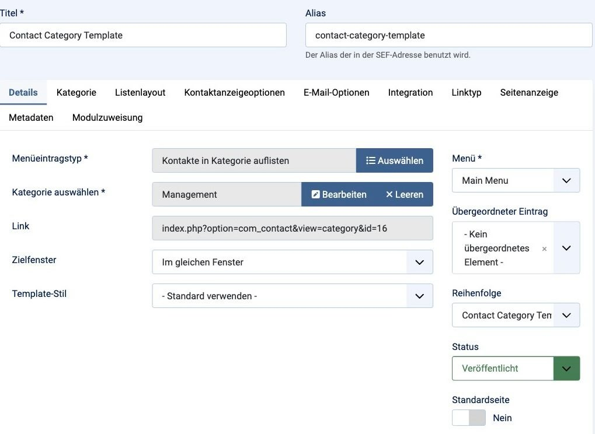

# Overview

## Einführung

Mit dem Kick YOOAddons Modul "Kontakte", kannst du Kontakte aus der Joomla Kontakt Komponente als dynamische Quelle in die YOOtheme Pro Layouts einbinden.

Standardmässig ist es nicht möglich ein Template für Kategorien anzulegen und Kontakte aus einer Kategorie anzeigen zu lassen. Mit unserem Addon kann dies umgesetzt werden und auf Daten der in der Kontaktkomponente gepflegten Kontakte dynamisch zugreifen.

## Video
