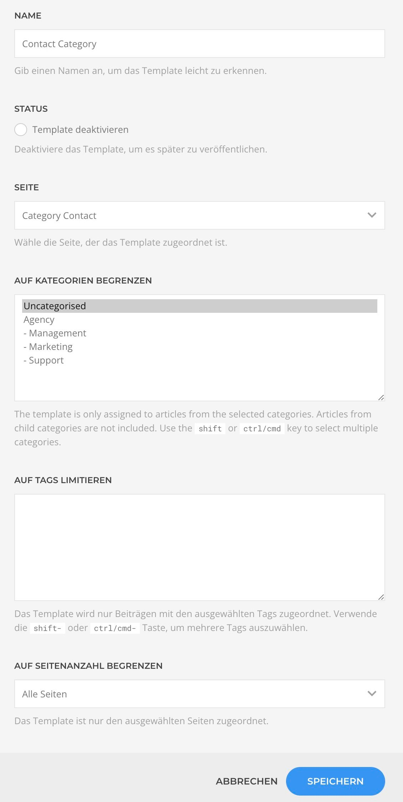
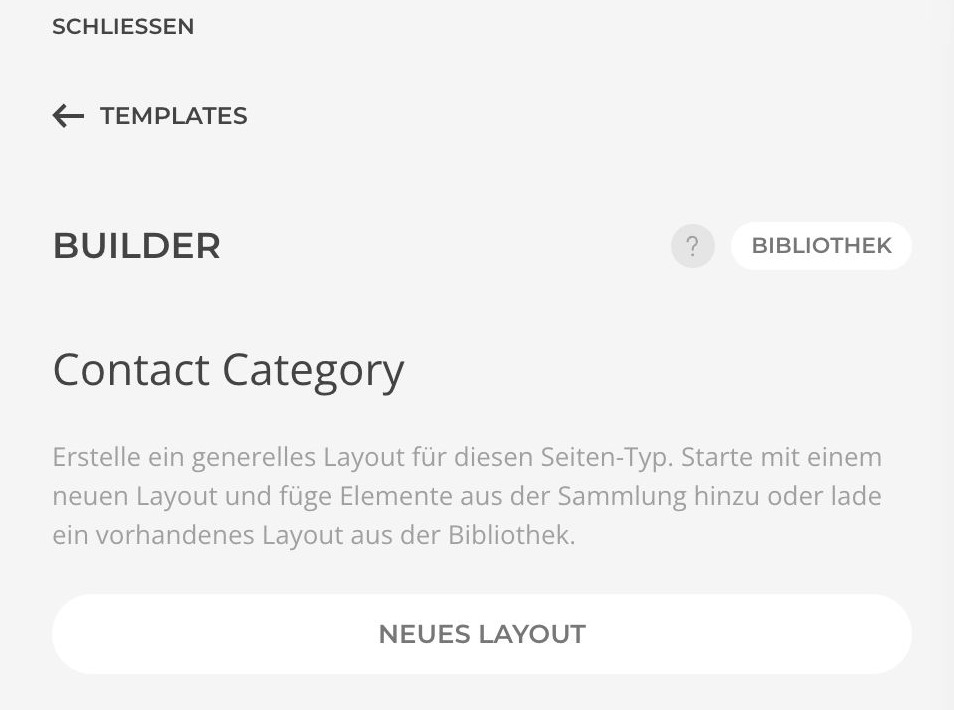
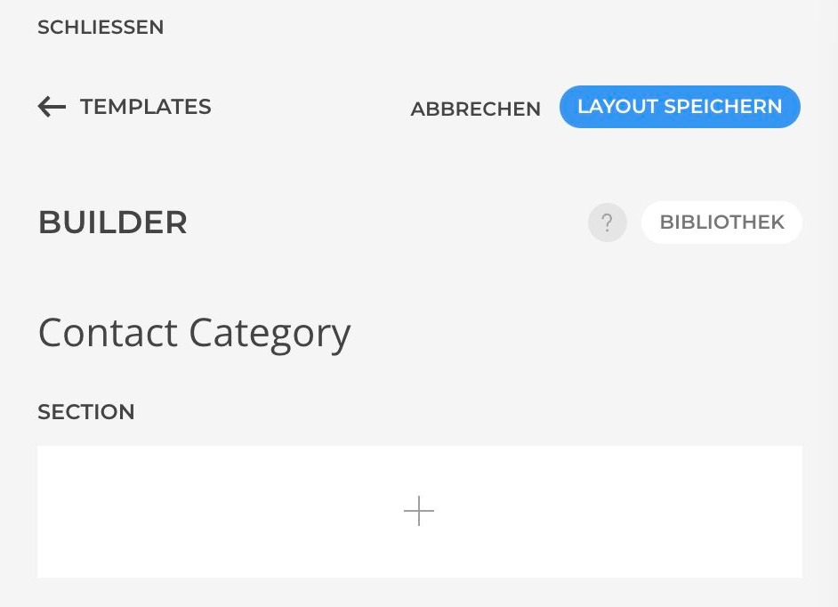
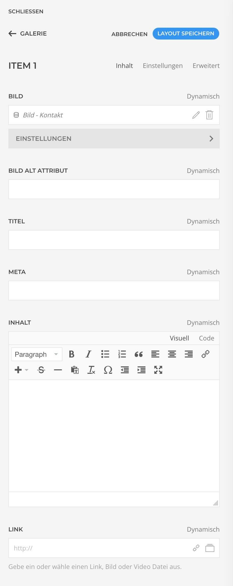

# Integration

1. Um Kontakte aus einer Kategorie als Quelle zu nutzen, kannst du nun im Builder unter Templates ein neues Template anlegen.
2. Benenne das Template und ordne es einer Seite zu.
3. Du hast jetzt die Möglichkeit auf Kategorien zu begrenzen oder es ausgewählten Tags zuzuordnen.

4. Nachdem das Template gespeichert wurde kann das Layout angepasst werden.

|                                                                  |                                                      |
|------------------------------------------------------------------|------------------------------------------------------|
|  |  |

Jetzt können die Kontakte als dynamische Quelle genutzt werden.

