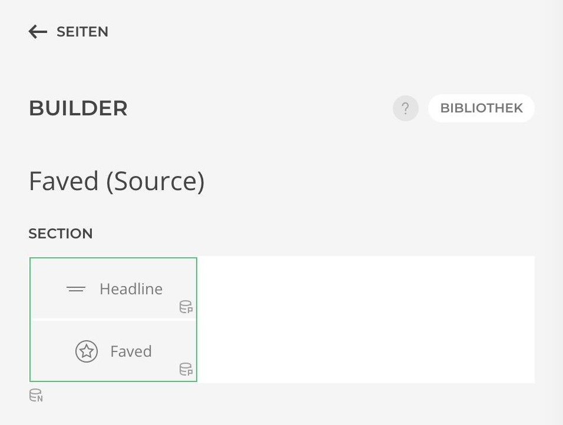
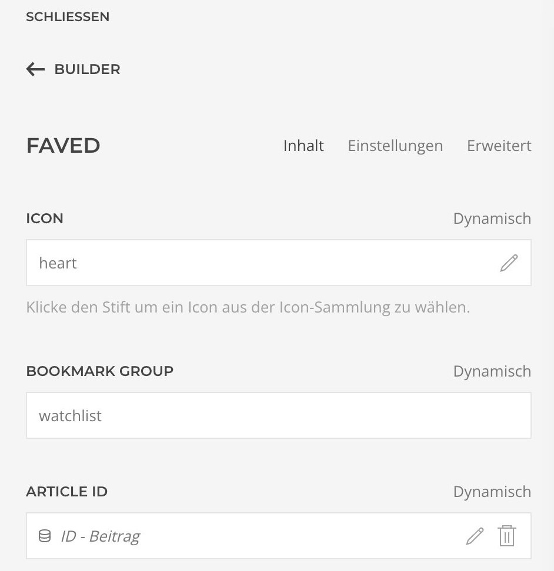
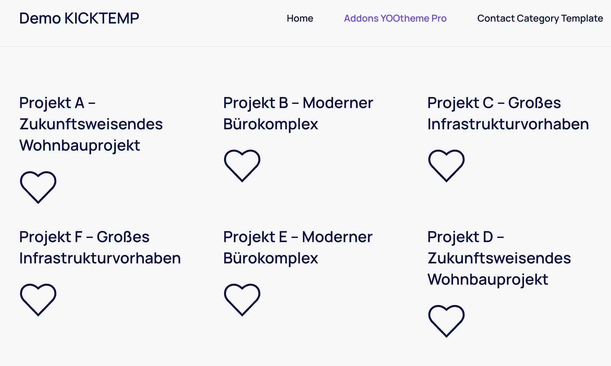
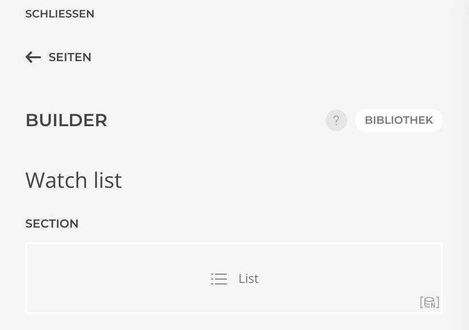
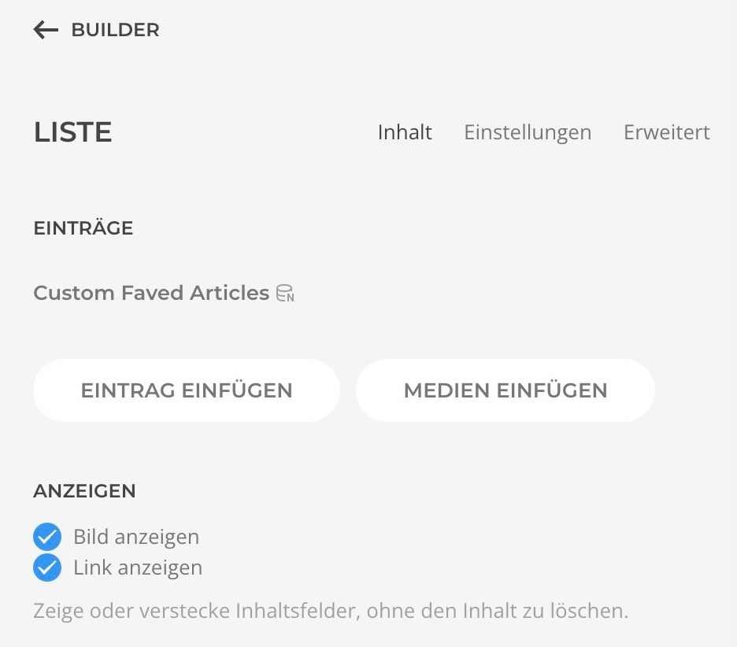
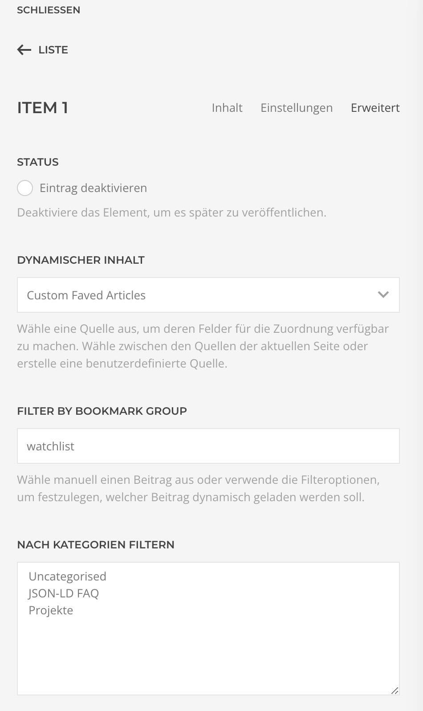

# Integration

**Artikel der Favoritenliste hinzufügen**

1. Erstelle mit dem Builder innerhalb einer Section das Faved-Element. Dieses findest du unter den Kicktemp Elements.

2. Wähle das Element aus, um es entsprechend anzupassen.
3. Im Bereich Icon fügst du nun ein gewünschtes Icon aus, über welches dann Beiträge der Favoritenliste hinzugefügt werden können.
4. Trage nun unter Bookmark group den Namen deiner Favoritenliste ein.
5. In der Spalte Article-ID wird dynamisch die Article-ID ausgegeben.

Nun kannst du Beiträge über einen Klick auf das Icon deiner Favoritenliste hinzufügen.

**Ausgabe der Favoritenliste**

1. Erstelle mit dem Builder innerhalb einer Section ein Element, um die Favoritenliste ausgeben zu lassen z.B. Liste. Es kann jedes Element dafür gewählt werden.

2. Wähle das Element aus, füge einen Eintrag ein, wähle diesen aus und gehe in die erweiterten Einstellungen.

3. Unter Dynamischer Inhalt muss nun "Custom Faved Articles" gewählt werden.
4. Setzte unter Filtered by Bookmark Group deine Benutzergruppe.

Jetzt werden alle Beiträge mit entsprechender ID dargestellt.

