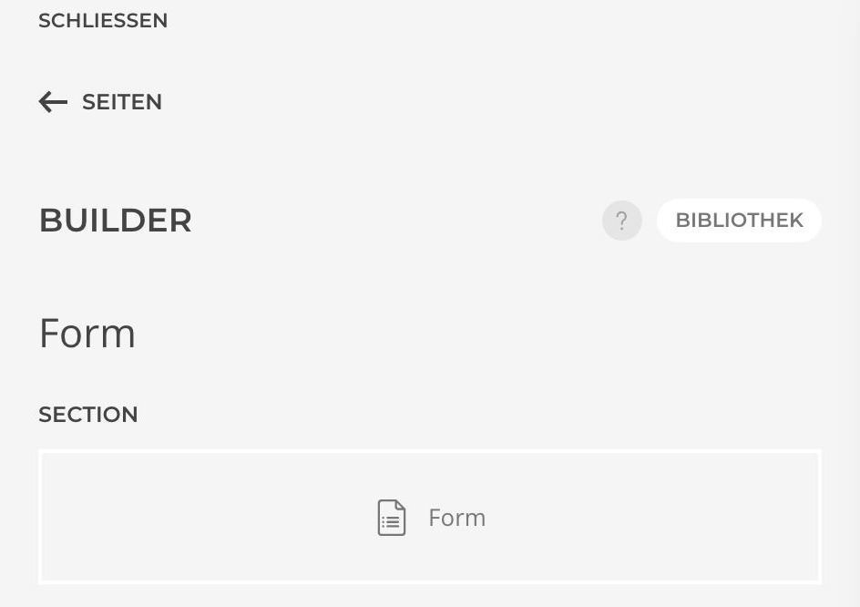
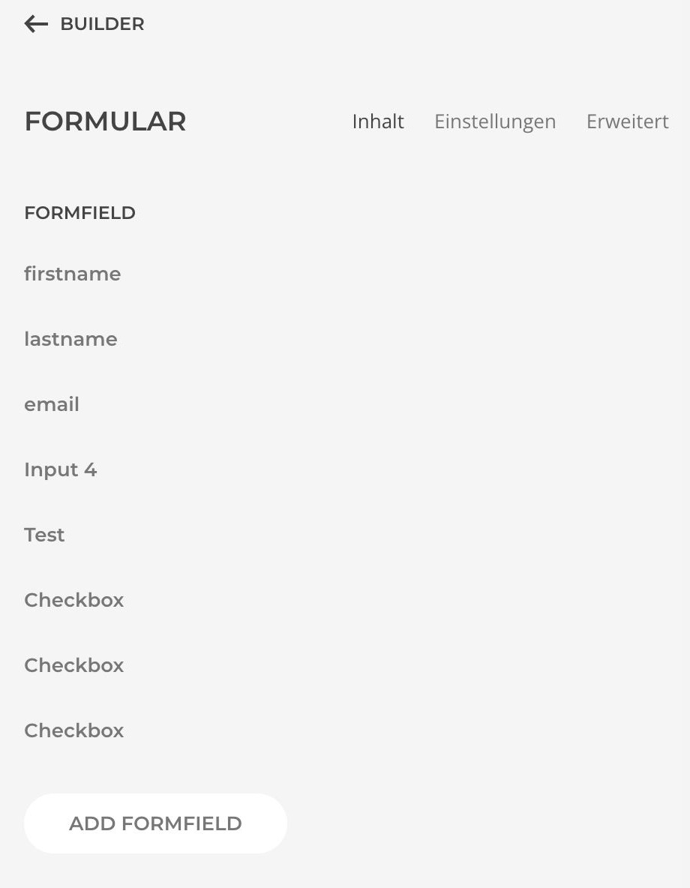
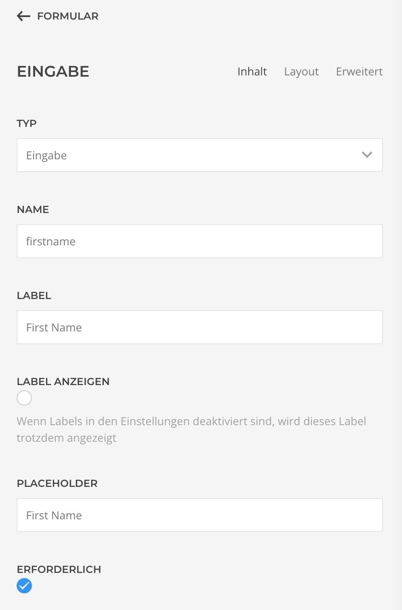
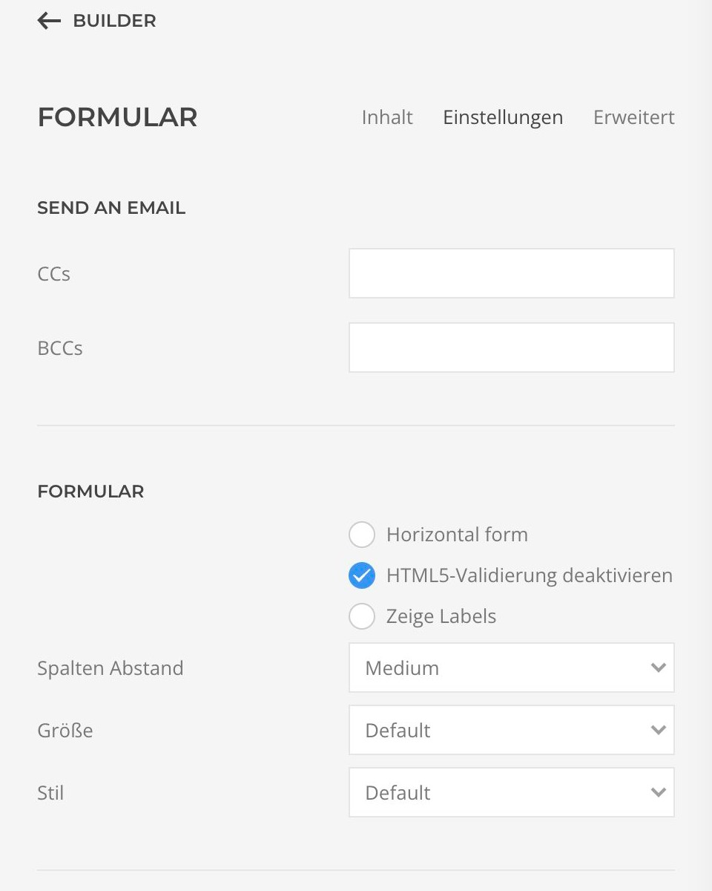
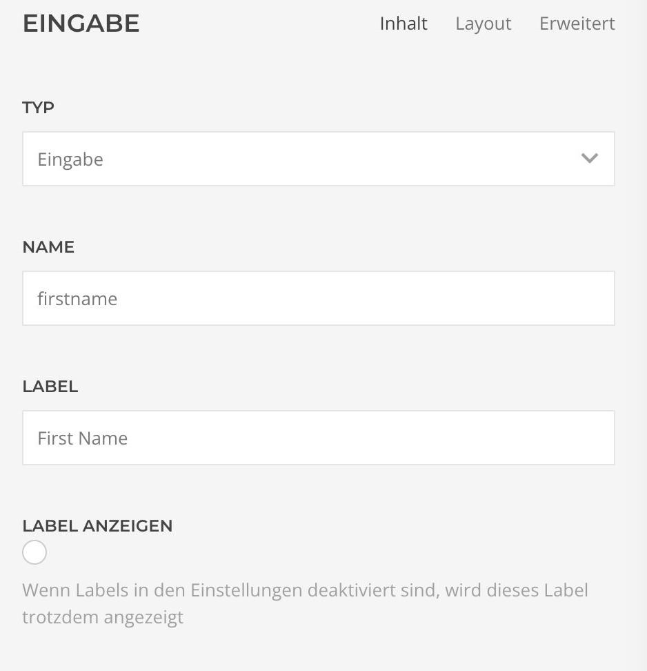
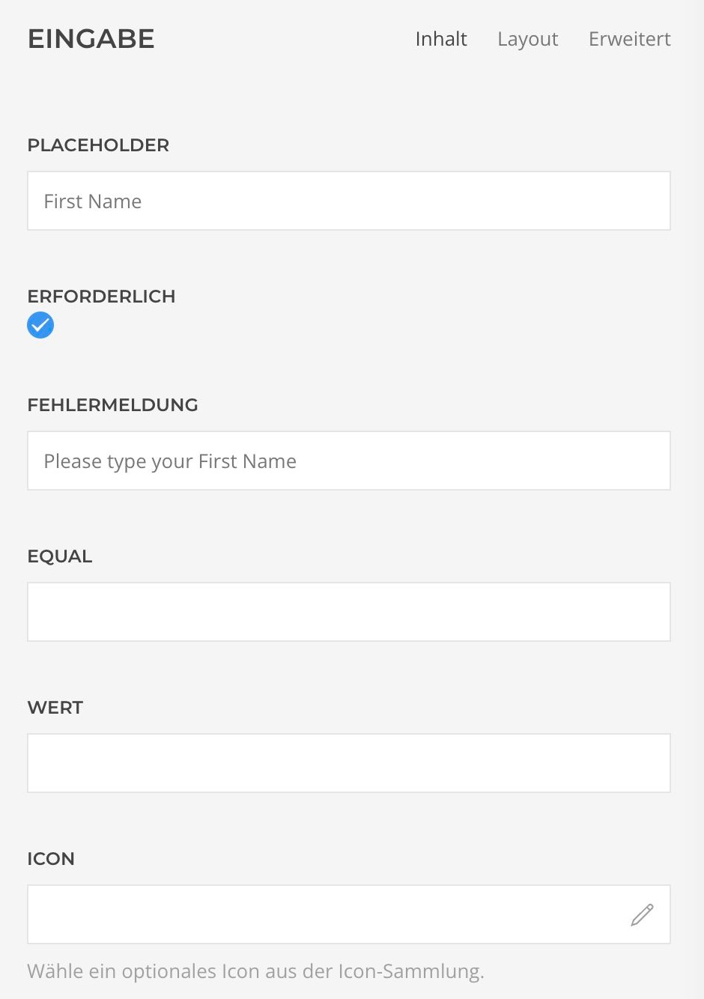
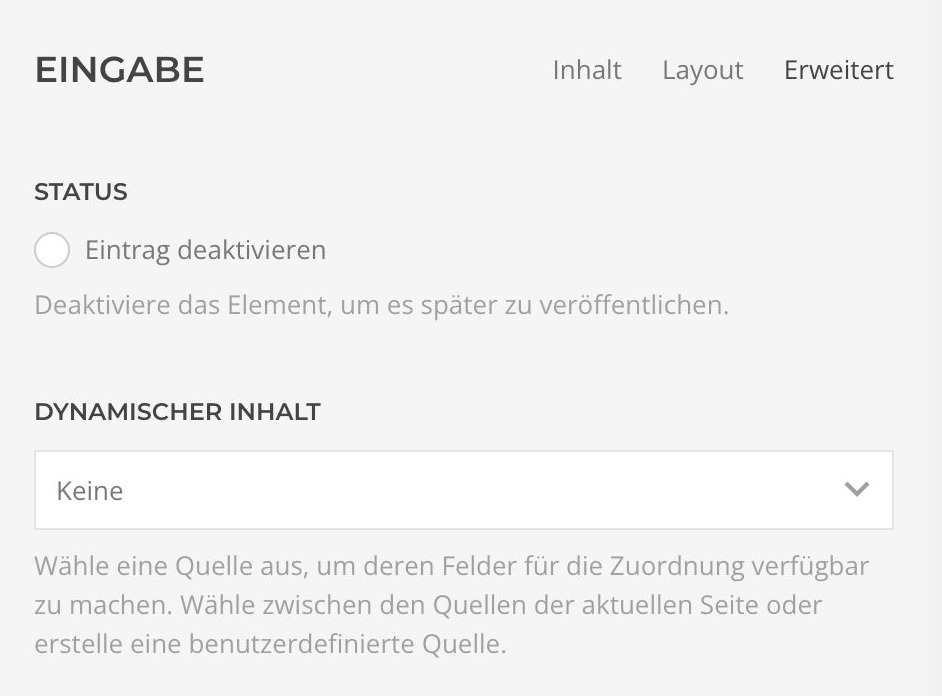
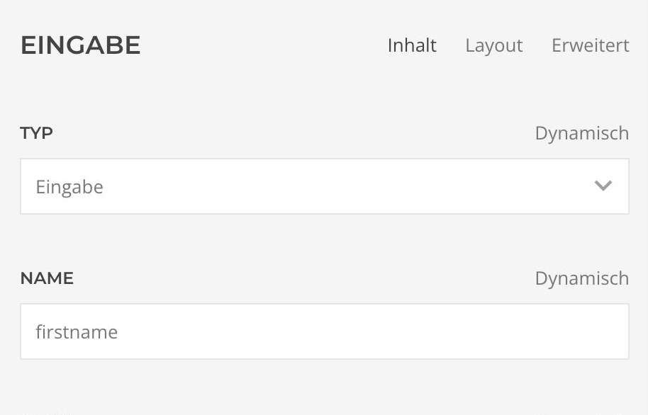
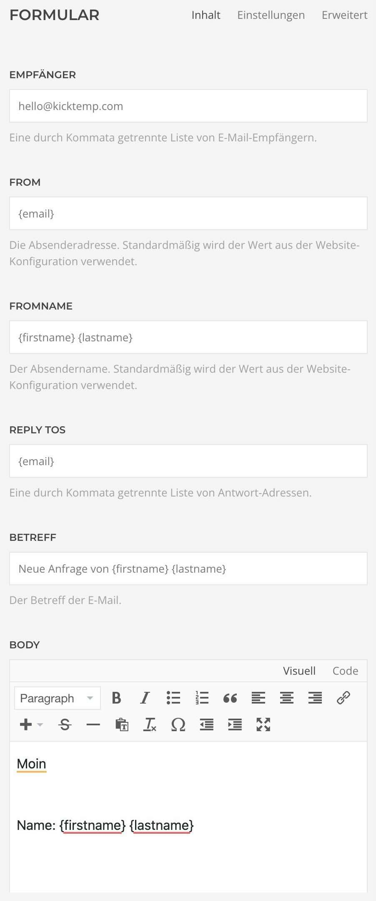

# Integration

1. Füge in einer Section das Element "Formular" hinzu.

2. Über den Button "Add Formfield" kannst du nun verschiedene Arten von Formularfeldern hinzufügen. Die Art kannst du im Dropdownmenü unter Typ auswählen. Jedes Feld muss nun mit einem Namen versehen werden. Dieser muss sprechend sein, da jedes der kommenden Felder mit einem Wert aus den obigen Feldern gefüllt werden kann.

|                                                                                    |                                                                |
|------------------------------------------------------------------------------------|----------------------------------------------------------------|
|  |  |

3. Damit der User weiß, welche Informationen er in entsprechendes Feld einzutragen hat, gib ein Label ein. Möchtest du kein Label nutzen sondern mit Platzhaltern arbeiten hast du die Möglichkeit die Label in den allgemeinen Formulareinstellungen auszuschalten. Sind die Labels deaktiviert, kann jedoch über "Label anzeigen" die Anzeige eines Labels individuell für jedes Feld erzwungen werden.

|                                                            |                                                                                |
|------------------------------------------------------------|--------------------------------------------------------------------------------|
|  |  |

4. Um die Einträge in Feldern abzugleichen kann im Feld Equal der Name des Feldes eingegeben werden, dem es entsprechen muss. Stimmt der Inhalt der Felder nicht überein, wird eine Fehlermeldung ausgegeben. Für diese kann ein individueller Text erstellt werden.

5. Felder können z.B. über dynamische Inhalte auch vorausgefüllt werden.

|                                                                                      |                                                                    |
|--------------------------------------------------------------------------------------|--------------------------------------------------------------------|
|  |  |

6. Im Feld Empfänger wird die E-Mailadresse an die das Formular versendet werden soll eingetragen. Hier kann auch eine Liste von E-Mailadressen eingetragen werden. Sollte dieses Feld nicht aussgefüllt werden, wird das Formular an die in der Konfiguration der Webseite angegebene E-Mailadresse gesendet. Das gleich gilt für das Feld "Absendername". Das Feld "Replys
to" gibt an, an wen die Antwort versendet wird, wenn auf die erhaltene Formular- E-Mail geantwortet wird.

Es können viele weitere Einstellungen vorgenommen werden. Die gesamten Einstellungsmöglichkeiten findest du im Detail unter Form- Settings (Link).
