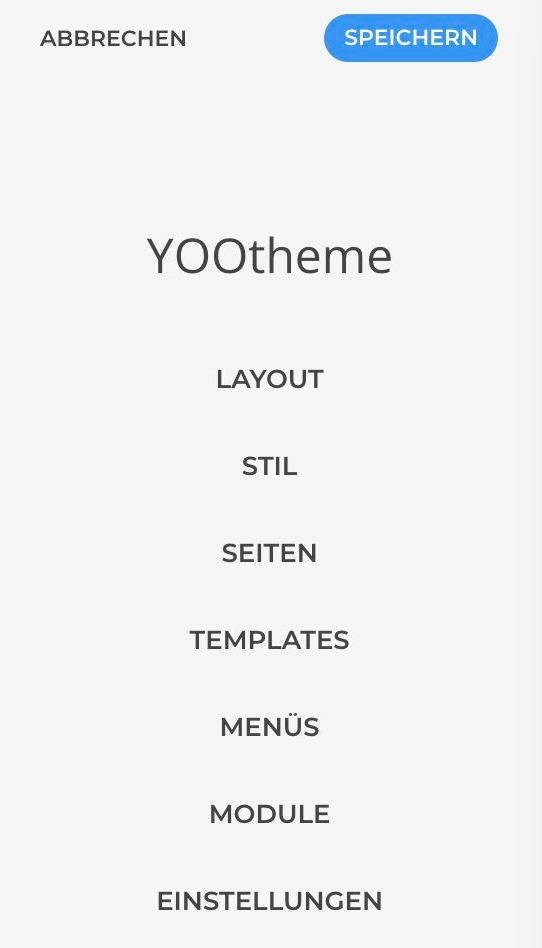
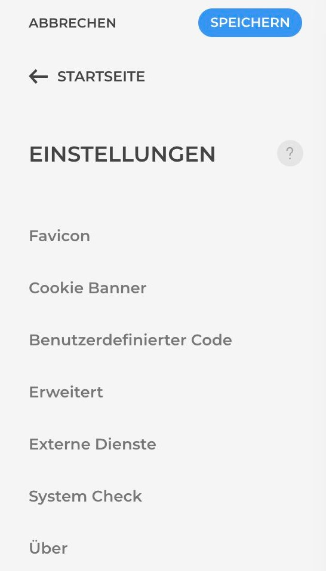
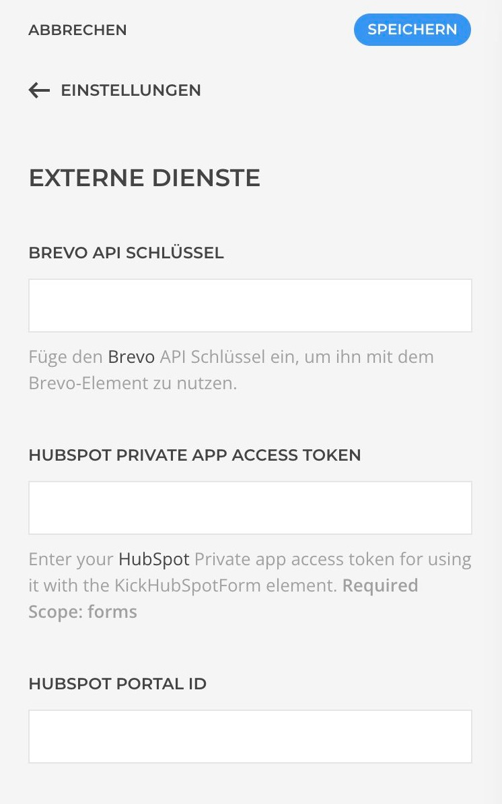
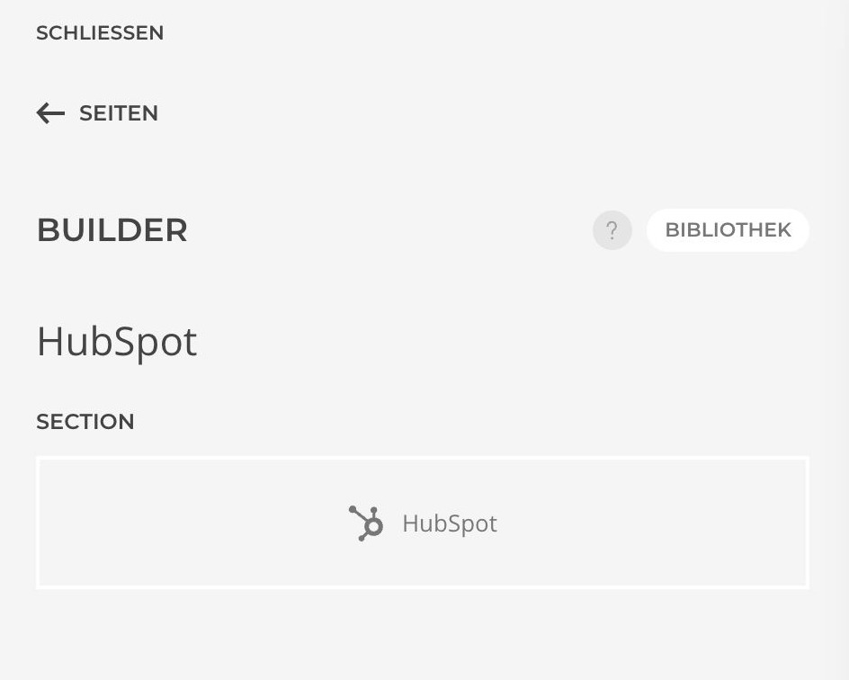
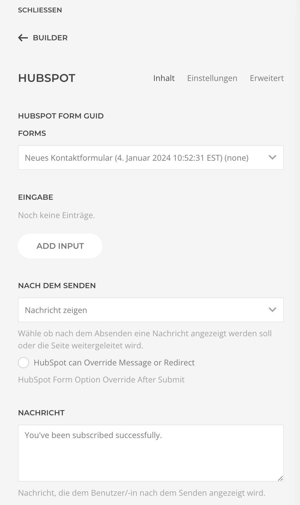
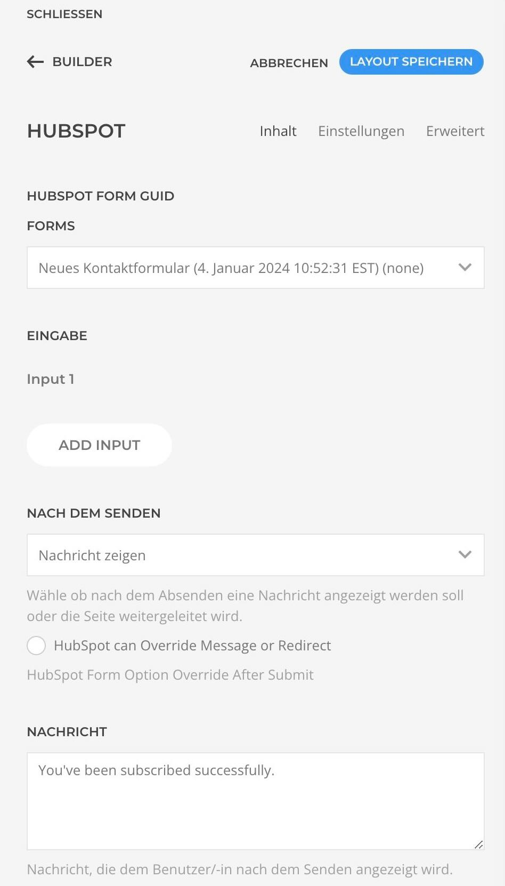

# Integration

1. Zuerst muss in den allgemeinen Einstellungen "Externe Dienste" dein Hubspot Privat APP Access Token und deine Portal-ID hinterlegt werden.

|                                                                           |                                                                             |                                                                               |
|---------------------------------------------------------------------------|-----------------------------------------------------------------------------|-------------------------------------------------------------------------------|
|  |  |  |

2. Um dann Hubspot mit Yootheme zu verbinden, fügst du in der gewünschten Section das Hubspot Element ein.

3. Jetzt wird im Hintergrund die Verbindung hergestellt.
4. Ist die Verbindung aktiv, kann im Dropdownmenu das gewünschte Formular ausgewählt werden und wird dann automatisch eingefügt.

|                                                                                 |                                                                                 |
|---------------------------------------------------------------------------------|---------------------------------------------------------------------------------|
|  |  |

Jetzt kann das Formular bearbeitet und angepasst werden. Über "Add Input" können weitere Felder hinzugefügt werden.

