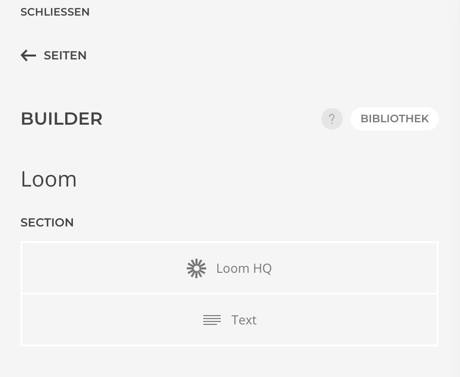
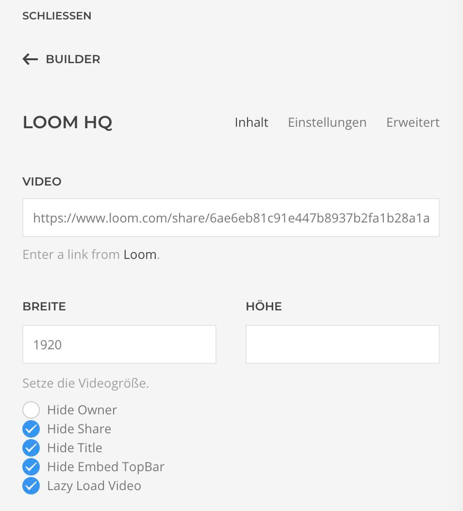

# Integration

1. Um ein Loom Video auf deiner Webseite einzubinden, erstellst du in der gewünschten Section das Loomelement.

2. Wähle es aus und füge im Feld "Video" den Link zu deinem Video ein. Den Link findest du in der oberen Menüleiste der Webseite deines Loomvideos.

Nun ist das Video auf deiner Webseite eingebunden. Du kannst entsprechende Einstellungen und Anpassungen vornehmen.
