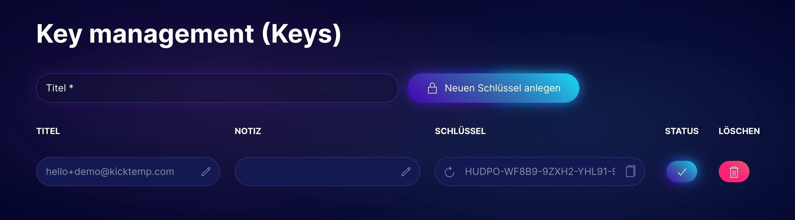
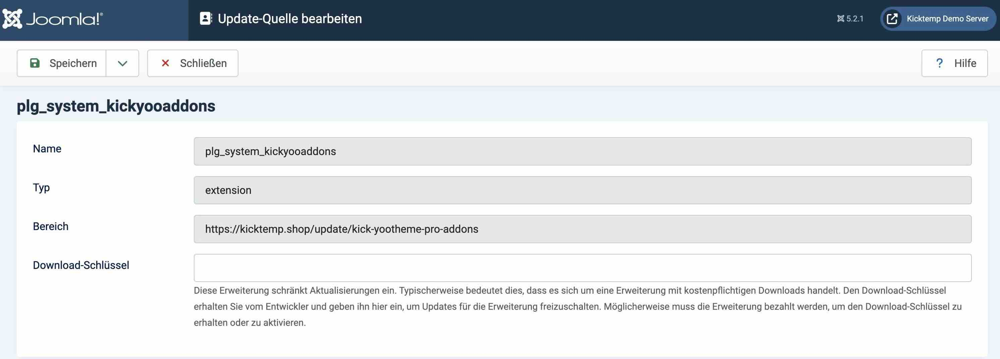

# Update

## Update durchführen

YOOaddons kannst du innerhalb von Joomla aktualisieren.
Sobald eine neue Version verfügbar ist, erhältst du eine Benachrichtigung in deinem Joomla! Dashboard.

> [!IMPORTANT]
>Um für das Plugin Updates durchführen zu können, musst du deinen Download Key in Joomla hinterlegen.

## Download-Key

Für jedes unserer Plugins erhältst du einen alphanumerischen Code (Update-Schlüssel/Download Key), der für jede Webseite individuell erstellt wird.

Deinen Schlüssel findest du, wenn du in unserem Shop angemeldet bist, im Dashboard unter dem Menüpunkt *Keys*. Hier kannst du Schlüssel verwalten, neu anlegen, benennen, aktivieren, deaktivieren und zurücksetzten (https://kicktemp.shop/dashboard/keys).

Im Joomla Backend findest du unter *System → Updates → Updatequellen* eine Liste deiner Erweiterungen. Wähle hier entsprechendes Plugin aus und füge den Schlüssel unter *Download-Schlüssel* ein. Das Plugin ist nun für Updates berechtigt.

