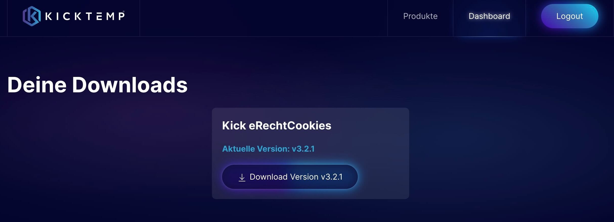

# Download

## Wie lade ich das Plugin herunter?

Bist du im Shop angemeldet, kannst du das Plugin unter folgendem Link herunterladen: [Download](https://kicktemp.shop/dashboard/downloads).

> [!NOTE]
>Das Plugin wird als .zip-Datei heruntergeladen.

