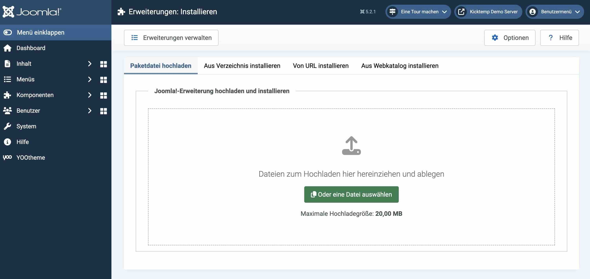
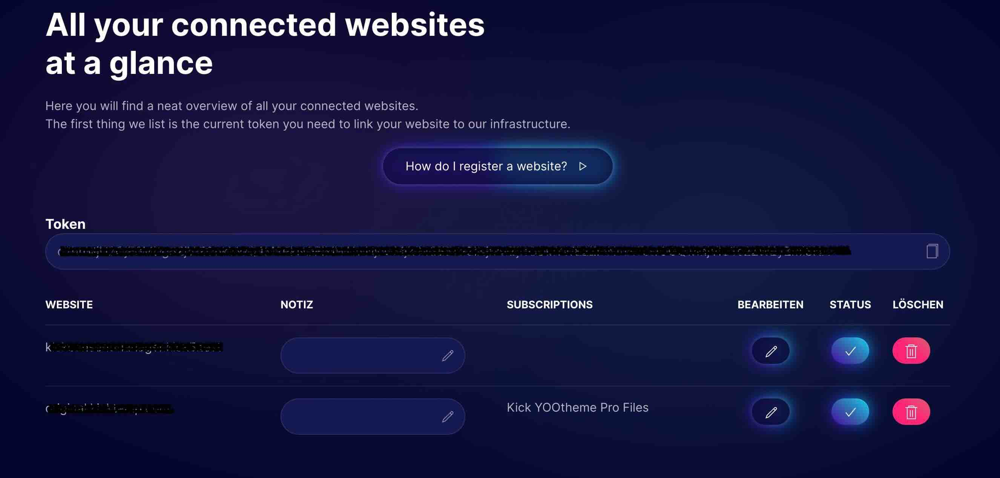
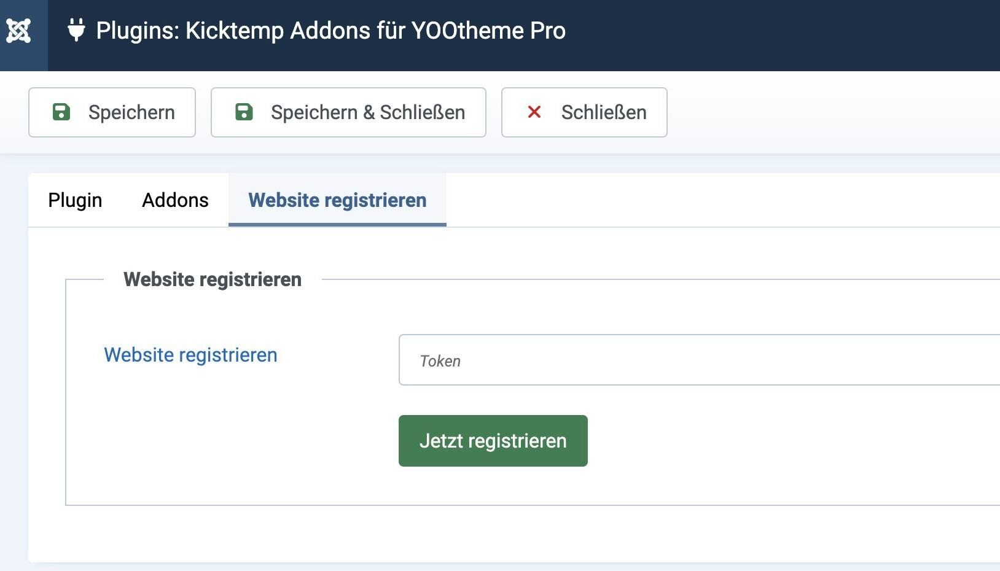
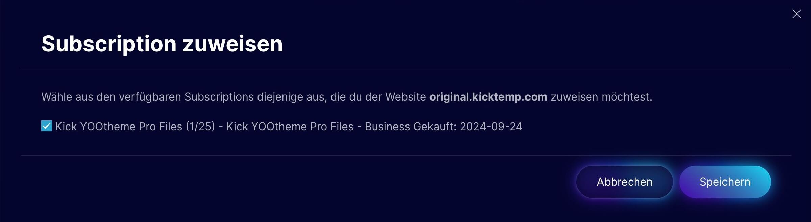

# Installation

## Das Plugin installieren

Rufe im Backend von Joomla (Administratoren Bereich) im Bereich *System* unter *Verwaltung* den Punkt *Erweiterungen* auf. Wähle dann in der oberen Menüleiste *Erweiterung installieren* aus. Lege die .zip-Datei, die du zuvor bei uns im Shop heruntergeladen hast (Link), per Drag and Drop ab. Das Plugin wird automatisch installiert.

> [!TIP]
>Offizielle Installationsanweisungen von Joomla Erweiterungen findest du unter folgendem Link: [Installing an extension](https://docs.joomla.org/Installing_an_extension).

## Webseite registrieren

Nach erfolgreicher Installation wird dir das Plugin unter dem Namen “Kick YOOaddons” in deinem Backend unter *Systeme → Plugins* aufgelistet und automatisch aktiviert.

Es muss die Webseite, für die du das Plugin verwendest, registriert werden.

Für jedes unserer Plugins erhältst du einen alphanumerischen Code (Token), der für jede Webseite individuell erstellt wird und im Plugin hinterlegt werden muss.
Den Token findest du in deinem [Dashboard](https://kicktemp.shop/dashboard/websites) im Bereich *Webseiten*.

Kopiere den Token und füge diesen im Backend von Joomla unter *System → Verwalten → Plugins* in entsprechendem Plugin unter *Website registrieren* ein.

Um deine Webseite endgültig zu registrieren, musst du diese in deinem Dashboard unseres Shops deiner Subscription zuweisen. Wähle im [Dashboard](https://kicktemp.shop/dashboard/websites) den Punkt *Webseiten* aus und drücke unter Bearbeiten auf den *Stift* -Button.
Es öffnet sich ein neues Fenster, in welchem du jetzt die entsprechende Subscription deiner Webseite zuordnen kannst, in dem du diese anhakst. Über den Button *Speichern* kannst du deine Auswahl speichern. Damit ist hinterlegt, welches Produkt für die entsprechende Webseite Update berechtigt ist.

## Mindeststabilität

Wähle die Stabilität für Updates auf deiner Website, entweder Stable oder Beta.

| Release | Beschreibung                                                                                                                              |
|---------|-------------------------------------------------------------------------------------------------------------------------------------------|
| Stable  | Diese Version wurde sowohl von unserem Team als auch von der Community umfassend getestet. Verwende sie für produktive Websites.          |
| Beta    | Diese Version wurde von unserem Team umfassend getestet. Verwende sie, um uns bei der Fehlervermeidung in der stabilen Version zu helfen. |
